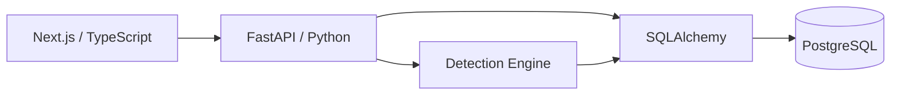

# CASE//ZERO

> A full-stack cybersecurity operations platform for detection, investigation, threat hunting, and incident response.


[](https://github.com/danielguillaumont/case-zero/actions/workflows/ci.yml)

---

## Overview

**CASE//ZERO** is a portfolio cybersecurity engineering project that models the workflow of a modern Security Operations Center.

It combines security telemetry, detection engineering, alert triage, case management, threat hunting, MITRE ATT&CK context, response playbooks, and threat intelligence in one connected investigation platform.

```text
Security Events
      ↓
Detection Engine
      ↓
Detection Rules
      ↓
Alerts
   ↙       ↘
Evidence   Investigation
          ↙     ↓      ↘
    Threat Hunt Case  Playbook
          ↓
   Threat Intelligence
```

---

## Current Capabilities

### Security Events

- Normalized security-event ingestion
- Endpoint, process, and authentication telemetry
- Event explorer and detail views
- Raw event evidence
- Event-to-alert navigation

### Detection Engine

- Single-event detections
- Multi-event correlation
- Automatic alert generation
- Detection-rule provenance stored on alerts
- MITRE ATT&CK technique and tactic mappings

Current detections include:

- Encoded PowerShell
- PowerShell Download Cradle
- Authentication Brute Force

### Alert Investigation

- Alert lifecycle and analyst assignment
- Detection evidence
- Linked source events
- Linked detection rules
- MITRE ATT&CK context
- Threat-intelligence matches
- Recommended response playbooks
- Case creation and linking

### Case Management

- Investigation cases
- Analyst ownership
- Priority and lifecycle tracking
- Linked alerts
- Investigation notes
- Activity timeline

### Threat Hunting

- Structured telemetry queries
- Free-text searches
- Host, user, IP, process, source, and event filters
- Direct navigation into event evidence

### Detection Rules & Playbooks

- Detection-rule catalog and detail views
- Detection logic visibility
- MITRE ATT&CK mappings
- Rule-to-playbook mapping
- Ordered incident-response procedures
- Bidirectional Rule ↔ Playbook navigation

### Threat Intelligence

- Persistent IOC registry
- IP, domain, URL, and hash indicators
- Reputation and confidence scoring
- Tags and analyst context
- Search and filtering
- IOC detail pages
- IOC-to-event correlation
- Alert-to-IOC intelligence matching

---

## Investigation Flow

CASE//ZERO supports a connected analyst workflow:

```text
Telemetry
   ↓
Detection Engine
   ↓
Detection Rule
   ↓
Alert
   ├── Source Evidence
   ├── MITRE ATT&CK
   ├── Threat Intelligence
   ├── Response Playbook
   ├── Threat Hunt
   └── Investigation Case
```

The goal is to preserve context as an analyst moves from detection through investigation and response.

---

## Testing & Continuous Integration

CASE//ZERO includes automated validation across the detection engine, API, database, and frontend.

### Backend

- Detection-engine unit tests
- Detection-rule behavior tests
- API integration tests
- PostgreSQL-backed end-to-end pipeline tests
- Detection and event-linkage validation
- Multi-event correlation testing

Current backend suite:

```text
22 tests passing
```

Database-backed tests validate workflows such as:

```text
Security Event
      ↓
PostgreSQL
      ↓
Detection Engine
      ↓
Persisted Alert
      ↓
API Retrieval
```

The test suite also verifies that benign telemetry does not generate alerts and that multi-event authentication correlation triggers only after the configured threshold.

### GitHub Actions

Every push and pull request to `main` runs the CASE//ZERO CI workflow.

The pipeline:

```text
Backend Tests
├── PostgreSQL 18 service
├── Python environment
├── Backend dependencies
├── Alembic migrations
└── Pytest suite

Frontend Build
├── Node.js environment
├── npm dependencies
└── Next.js production build
```

This provides automated database migration, backend regression, detection-pipeline, and frontend build validation.

---

## Technology Stack

| Area | Technology |
|---|---|
| Frontend | Next.js, React, TypeScript |
| Styling | Tailwind CSS |
| Backend | FastAPI, Python |
| Validation | Pydantic |
| ORM | SQLAlchemy |
| Database | PostgreSQL |
| Database Driver | Psycopg |
| Migrations | Alembic |
| Testing | Pytest, FastAPI TestClient |
| CI/CD | GitHub Actions |
| Containers | Docker / Docker Compose |
| API Docs | Swagger / OpenAPI |
| Version Control | Git / GitHub |

---

## Architecture



Core API modules:

```text
/api/events
/api/alerts
/api/cases
/api/hunt
/api/rules
/api/playbooks
/api/intelligence
```

---

## Running Locally

### Requirements

- Python 3.12+
- Node.js / npm
- Docker Desktop
- Git

### Clone

```powershell
git clone https://github.com/danielguillaumont/case-zero.git
cd case-zero
```

### Environment

```powershell
Copy-Item .env.example .env
```

Configure the PostgreSQL values in `.env` before starting the application.

### PostgreSQL

```powershell
docker compose up -d postgres
```

### Backend

```powershell
cd backend

python -m venv .venv
.\.venv\Scripts\Activate.ps1

pip install -r requirements.txt
alembic upgrade head

fastapi dev app\main.py
```

Backend:

```text
http://127.0.0.1:8000
```

Swagger:

```text
http://127.0.0.1:8000/docs
```

### Frontend

In another terminal:

```powershell
cd frontend
npm install
npm run dev
```

Frontend:

```text
http://localhost:3000
```

---

## Development Status

### Implemented

- [x] Full-stack application architecture
- [x] PostgreSQL persistence and Alembic migrations
- [x] SOC dashboard
- [x] Security-event ingestion
- [x] Security Event Explorer
- [x] Detection engine
- [x] Automatic alert generation
- [x] Multi-event correlation
- [x] Alert investigation workflow
- [x] Case management
- [x] Investigation notes
- [x] Case activity timeline
- [x] Threat hunting
- [x] Detection Rules workspace
- [x] MITRE ATT&CK mappings
- [x] Incident Response Playbooks
- [x] Rule ↔ Alert ↔ Playbook navigation
- [x] Threat Intelligence registry
- [x] IOC-to-event correlation
- [x] Alert-to-IOC intelligence matching
- [x] Automated unit and API testing
- [x] PostgreSQL-backed end-to-end testing
- [x] GitHub Actions continuous integration

### Next

- [ ] Authentication and role-based access control
- [ ] Additional detections and telemetry types
- [ ] Production deployment
- [ ] Production security hardening
- [ ] Portfolio screenshots and demonstration workflow

---

## Project Goal

CASE//ZERO is designed to demonstrate both defensive cybersecurity concepts and the software engineering behind modern security platforms.

The project combines:

- Detection engineering
- Security operations
- Incident response
- Threat hunting
- Threat intelligence
- MITRE ATT&CK
- Security automation
- API development
- Relational data modeling
- Automated testing
- CI/CD
- Full-stack application design

---

## Disclaimer

CASE//ZERO is an independent educational and portfolio project designed to simulate cybersecurity operations workflows.

It is not intended to replace a production SIEM, SOAR, EDR, threat-intelligence platform, or enterprise incident-response system.