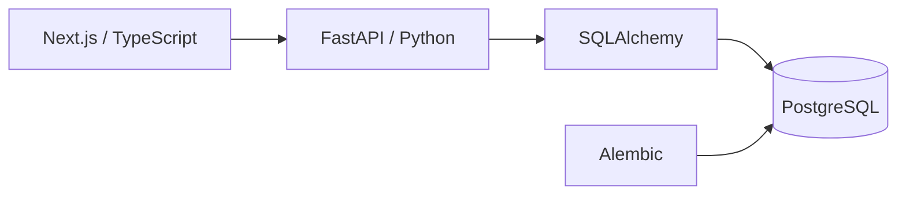

# CASE//ZERO

> A full-stack cybersecurity operations platform for alert triage, investigation, and case management.


---

## What is CASE//ZERO?

**CASE//ZERO** is a cybersecurity engineering project that models the workflow of a modern Security Operations Center.

The goal is to build a working security platform where telemetry can eventually move through detection, alert triage, investigation, case management, threat hunting, and response.

Instead of being a static dashboard, CASE//ZERO uses a real full-stack architecture with persistent security data and interactive analyst workflows.

```text
Security Events
      ↓
Detection
      ↓
Alerts
      ↓
Triage
      ↓
Investigation
      ↓
Cases
      ↓
Resolution
```

---

## What Works Today

### Dashboard

The SOC-style dashboard currently displays live application data including:

- API health
- PostgreSQL health
- Open alerts
- Critical alerts
- Recent alert activity
- Investigation metrics

### Alert Management

Security alerts can be created, viewed, updated, assigned, and investigated.

Current workflow:

```text
NEW
 ↓
Assign Analyst
 ↓
INVESTIGATING
 ↓
RESOLVED
```

Analyst actions made in the interface are persisted through the full application stack:

```text
Next.js
   ↓
Server Actions
   ↓
FastAPI
   ↓
SQLAlchemy
   ↓
PostgreSQL
```

### Case Management

The backend case-management foundation currently supports:

- Creating investigation cases
- Listing cases
- Retrieving individual cases
- Updating cases
- Priority and status tracking
- Analyst ownership
- Linking alerts to cases
- Multiple alerts per investigation case

The Cases frontend is currently under development.

---

## Architecture



---

## Technology Stack

| Area | Technology |
|---|---|
| Frontend | Next.js, React, TypeScript |
| Styling | Tailwind CSS |
| Backend | FastAPI, Python |
| Validation | Pydantic |
| ORM | SQLAlchemy |
| Database | PostgreSQL |
| Migrations | Alembic |
| Containers | Docker / Docker Compose |
| API Docs | Swagger / OpenAPI |
| Version Control | Git / GitHub |

---

## Current API

### Alerts

```text
GET    /api/alerts
POST   /api/alerts
GET    /api/alerts/{alert_id}
PATCH  /api/alerts/{alert_id}
```

### Cases

```text
GET    /api/cases
POST   /api/cases
GET    /api/cases/{case_id}
PATCH  /api/cases/{case_id}
```

### Platform

```text
GET    /api/health
```

Interactive Swagger documentation is available at:

```text
http://127.0.0.1:8000/docs
```

---

## Repository Structure

```text
case-zero/
│
├── backend/
│   ├── alembic/
│   └── app/
│       ├── api/routes/
│       ├── models/
│       ├── schemas/
│       ├── database.py
│       └── main.py
│
├── frontend/
│   └── src/
│       ├── app/
│       │   └── alerts/
│       └── lib/
│
├── compose.yaml
├── .env.example
└── README.md
```

---

## Running Locally

### Requirements

- Python 3.12+
- Node.js
- npm
- Docker Desktop
- Git

### 1. Clone

```bash
git clone https://github.com/danielguillaumont/case-zero.git
cd case-zero
```

### 2. Environment

Create the local environment file:

```powershell
Copy-Item .env.example .env
```

### 3. PostgreSQL

```bash
docker compose up -d postgres
```

### 4. Backend

```powershell
cd backend

python -m venv .venv

.\.venv\Scripts\Activate.ps1

pip install -r requirements.txt

alembic upgrade head

fastapi dev app\main.py
```

Backend:

```text
http://127.0.0.1:8000
```

### 5. Frontend

In another terminal:

```powershell
cd frontend

npm install

npm run dev
```

Frontend:

```text
http://localhost:3000
```

---

## Development Roadmap

### Completed

- [x] Full-stack project foundation
- [x] PostgreSQL persistence
- [x] Alembic migrations
- [x] SOC dashboard
- [x] Alert API
- [x] Alert management interface
- [x] Alert investigation workflow
- [x] Analyst assignment
- [x] Case database model
- [x] Case API
- [x] Alert-to-case relationships

### In Progress

- [ ] Linked alerts inside case details
- [ ] Cases frontend
- [ ] Case detail interface
- [ ] Create case directly from an alert
- [ ] Investigation notes and timeline

### Planned

- [ ] Security event ingestion
- [ ] Detection rule engine
- [ ] Automatic alert generation
- [ ] Threat hunting
- [ ] Threat intelligence
- [ ] Investigation playbooks
- [ ] Authentication and RBAC
- [ ] Automated testing and CI/CD
- [ ] Production deployment

---

## Long-Term Goal

The completed CASE//ZERO workflow is intended to support:

```text
Security Telemetry
        ↓
Event Ingestion
        ↓
Detection Rules
        ↓
Alert Generation
        ↓
Analyst Triage
        ↓
Investigation Case
        ↓
Threat Hunting
        ↓
Evidence & Findings
        ↓
Resolution
```

The project is being developed to explore both **cybersecurity operations** and the **software engineering behind security platforms**.

---

## Project Status

CASE//ZERO is under active development.

The project currently has a working Next.js frontend, FastAPI backend, PostgreSQL database, alert investigation workflow, analyst assignment, case-management API, and persistent alert-to-case relationships.

**Current focus:** completing the Case Management interface before beginning the event pipeline and detection engine.

---

## Disclaimer

CASE//ZERO is an independent educational and portfolio project designed to simulate cybersecurity operations workflows.

It is not intended to replace a production SIEM, SOAR, EDR, or enterprise incident-response platform.