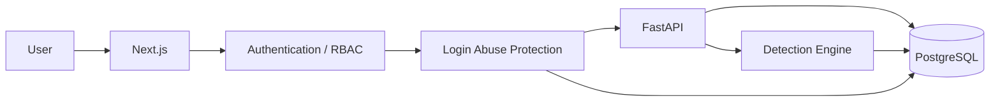

# CASE//ZERO

> A full-stack cybersecurity operations platform for detection, investigation, threat hunting, and incident response.


[](https://github.com/danielguillaumont/case-zero/actions/workflows/ci.yml)

---

## Overview

**CASE//ZERO** is a cybersecurity engineering project that simulates the workflow of a modern Security Operations Center.

It connects security telemetry, detection engineering, alerts, investigations, threat hunting, threat intelligence, MITRE ATT&CK, incident-response playbooks, authentication, and role-based access control in one application.

```text
Security Events
      ↓
Detection Engine
      ↓
Detection Rules
      ↓
Alerts
   ↙       ↘
Evidence   Investigation
          ↙     ↓      ↘
       Hunt   Case   Playbook
          ↓
   Threat Intelligence
```

---

## Core Capabilities

### Detection & Telemetry

- Normalized security-event ingestion
- Process and authentication telemetry
- Single-event detections
- Multi-event correlation
- Automatic alert generation
- Source-event and detection-rule linkage
- MITRE ATT&CK mappings

Current detections include:

- Encoded PowerShell
- PowerShell Download Cradle
- Authentication Brute Force

### Investigation

- Alert lifecycle and analyst assignment
- Source-event evidence
- Detection-rule context
- MITRE ATT&CK context
- Threat-intelligence matches
- Recommended response playbooks
- Investigation cases
- Analyst notes
- Case activity timelines

### Threat Hunting

- Structured telemetry searches
- Free-text queries
- Host, user, IP, process, source, and event filters
- Direct navigation into event evidence

### Threat Intelligence

- Persistent IOC registry
- IP, domain, URL, and hash indicators
- Reputation and confidence scoring
- Search, filtering, and tags
- IOC-to-event correlation
- Alert-to-IOC matching

### Detection Rules & Playbooks

- Detection-rule catalog
- Detection logic visibility
- ATT&CK mappings
- Rule-to-playbook relationships
- Ordered incident-response procedures
- Bidirectional Rule ↔ Playbook navigation

---

## Authentication & Access Control

CASE//ZERO includes end-to-end authentication and role-based access control.

- PostgreSQL-backed user accounts
- Argon2 password hashing
- JWT access tokens
- HttpOnly session cookies
- Login and logout workflow
- Current-user validation
- Administrator, Analyst, and Viewer roles
- Route-level authorization across SOC APIs
- Protected frontend application routes
- Administrator provisioning utility
- Generic authentication failure responses
- Timing-resistant unknown-user password verification
- Persistent login-attempt throttling
- Temporary authentication cooldowns
- HTTP `429` and `Retry-After` enforcement

```text
Email + Password
       ↓
Login Abuse Protection
       ↓
Argon2 Verification
       ↓
JWT Access Token
       ↓
HttpOnly Session
       ↓
Authenticated User
       ↓
Role Authorization
```

| Role | Access |
|---|---|
| **Administrator** | Full platform access |
| **Analyst** | Security operations, hunting, investigations, ingestion, and updates |
| **Viewer** | Read-only SOC visibility |

Unauthenticated users cannot access protected SOC data.

---

## Security Hardening

Production-readiness work currently includes:

- Environment-based application configuration
- Production configuration validation
- Trusted Host enforcement
- Production-aware Swagger / OpenAPI exposure
- Public liveness endpoint with minimal disclosure
- Authenticated platform-status endpoint
- HttpOnly session cookies
- Production `Secure` / `__Host-` cookie strategy
- Server-only authentication utilities
- JWT expiration and integrity validation
- Persistent PostgreSQL-backed login throttling
- Generic authentication errors to reduce account enumeration
- Temporary lockout instead of permanent account disablement

Public health:

```text
GET /api/health

{"status":"online"}
```

Detailed platform status requires authentication.

---

## Security Workspaces

CASE//ZERO currently includes:

```text
Dashboard
Events
Alerts
Cases
Threat Hunt
Threat Intelligence
Detection Rules
Response Playbooks
```

Each workspace participates in the same investigation workflow rather than operating as an isolated demo.

---

## Testing & CI

CASE//ZERO currently has **86 passing backend tests** covering:

- Detection-engine logic
- Multi-event correlation
- Authentication
- Password security
- JWT creation and validation
- Login throttling
- Generic authentication failures
- Role-based access control
- API authorization
- Application security controls
- Trusted Host validation
- Public and authenticated health endpoints
- Event ingestion
- Event-to-alert pipelines
- Alert workflows
- Case workflows
- Case notes and activity
- Threat hunting
- Threat intelligence
- Viewer, Analyst, and Administrator permissions

Example tested pipeline:

```text
Security Event
      ↓
PostgreSQL
      ↓
Detection Engine
      ↓
Persisted Alert
      ↓
Authenticated API Retrieval
```

Authentication abuse protection is also integration tested:

```text
Failed Login
     ↓
Persistent Throttle State
     ↓
Failure Threshold
     ↓
Temporary Cooldown
     ↓
429 + Retry-After
```

GitHub Actions validates the application on pushes and pull requests to `main`:

```text
Backend
├── PostgreSQL 18
├── Alembic migrations
└── Pytest

Frontend
├── npm install
└── Next.js production build
```

---

## Technology Stack

| Area | Technology |
|---|---|
| Frontend | Next.js, React, TypeScript |
| Styling | Tailwind CSS |
| Backend | FastAPI, Python |
| Validation | Pydantic |
| ORM | SQLAlchemy |
| Database | PostgreSQL |
| Migrations | Alembic |
| Authentication | JWT, OAuth2 |
| Password Security | Argon2, pwdlib |
| Authorization | RBAC |
| Testing | Pytest, FastAPI TestClient |
| CI/CD | GitHub Actions |
| Containers | Docker Compose |
| API Docs | Swagger / OpenAPI |

---

## Architecture



Core APIs:

```text
/api/auth
/api/health
/api/status
/api/events
/api/alerts
/api/cases
/api/hunt
/api/rules
/api/playbooks
/api/intelligence
```

---

## Run Locally

### Requirements

- Python 3.12+
- Node.js
- Docker Desktop
- Git

### Setup

```powershell
git clone https://github.com/danielguillaumont/case-zero.git
cd case-zero

Copy-Item .env.example .env
docker compose up -d postgres
```

Configure PostgreSQL and JWT values in `.env`.

### Backend

```powershell
cd backend

python -m venv .venv
.\.venv\Scripts\Activate.ps1

pip install -r requirements.txt
alembic upgrade head

fastapi dev app\main.py
```

API:

```text
http://127.0.0.1:8000
```

Swagger in local development:

```text
http://127.0.0.1:8000/docs
```

API documentation can be disabled through environment configuration for production deployments.

### Create First Administrator

```powershell
python -m scripts.create_admin
```

### Frontend

```powershell
cd frontend
npm install
npm run dev
```

Frontend:

```text
http://localhost:3000
```

---

## Development Status

### Implemented

- [x] Full-stack SOC application
- [x] PostgreSQL + Alembic
- [x] Security-event ingestion
- [x] Detection engine
- [x] Multi-event correlation
- [x] Automated alert generation
- [x] Alert investigation
- [x] Case management
- [x] Analyst notes and activity timelines
- [x] Threat hunting
- [x] MITRE ATT&CK mappings
- [x] Incident-response playbooks
- [x] Threat Intelligence registry
- [x] IOC correlation
- [x] JWT authentication
- [x] HttpOnly frontend sessions
- [x] Login and logout workflow
- [x] Argon2 password hashing
- [x] Administrator / Analyst / Viewer roles
- [x] Route-level RBAC enforcement
- [x] Protected frontend application access
- [x] Trusted Host enforcement
- [x] Production API documentation controls
- [x] Public / authenticated health separation
- [x] Persistent login abuse protection
- [x] Generic authentication failure handling
- [x] Database-backed integration tests
- [x] GitHub Actions CI

### Next

- [ ] Security and authentication audit logging
- [ ] Frontend security headers and CSP
- [ ] Production deployment configuration
- [ ] Final production security review
- [ ] First public deployment
- [ ] Portfolio screenshots
- [ ] Architecture and investigation demo

---

## Project Direction

CASE//ZERO is evolving toward a case-centered security operations platform where detections, evidence, investigations, analyst decisions, response actions, and future automation share a common investigation context.

Longer-term development will explore:

- Case-centric SOAR workflows
- Evidence and investigation graphs
- Security-tool connectors
- Detection-as-Code
- Investigation intelligence
- AI-assisted security analysis
- Human approval gates for response actions
- Detection feedback and outcome learning

---

## Project Goal

CASE//ZERO demonstrates practical experience across:

**Detection Engineering · Security Operations · Incident Response · Threat Hunting · Threat Intelligence · MITRE ATT&CK · Authentication · Application Security · RBAC · API Development · Database Engineering · Full-Stack Development · Automated Testing · CI/CD**

---

## Disclaimer

CASE//ZERO is an independent educational and portfolio project designed to simulate cybersecurity operations workflows.

It is not intended to replace a production SIEM, SOAR, EDR, identity provider, or enterprise incident-response platform.