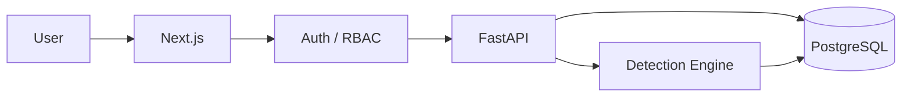

# CASE//ZERO

> A full-stack cybersecurity operations platform for detection, investigation, threat hunting, and incident response.


[](https://github.com/danielguillaumont/case-zero/actions/workflows/ci.yml)

---

## Overview

**CASE//ZERO** is a cybersecurity engineering portfolio project that models the workflow of a modern Security Operations Center.

It connects security telemetry, detection engineering, alert investigation, threat hunting, case management, MITRE ATT&CK, threat intelligence, response playbooks, authentication, and role-based access control in one application.

```text
Security Events
      ↓
Detection Engine
      ↓
Detection Rules
      ↓
Alerts
   ↙       ↘
Evidence   Investigation
          ↙     ↓      ↘
       Hunt   Case   Playbook
          ↓
   Threat Intelligence
```

---

## Core Capabilities

### Detection & Telemetry

- Normalized security-event ingestion
- Process and authentication telemetry
- Single-event detections
- Multi-event correlation
- Automatic alert generation
- Source-event and detection-rule linkage
- MITRE ATT&CK mappings

Current detections:

- Encoded PowerShell
- PowerShell Download Cradle
- Authentication Brute Force

### Investigation

- Alert lifecycle and analyst assignment
- Source evidence
- Detection-rule context
- MITRE ATT&CK context
- Threat-intelligence matches
- Recommended response playbooks
- Investigation cases
- Notes and activity timelines

### Threat Hunting

- Structured telemetry searches
- Free-text queries
- Host, user, IP, process, source, and event filters
- Direct navigation into event evidence

### Threat Intelligence

- Persistent IOC registry
- IP, domain, URL, and hash indicators
- Reputation and confidence scoring
- Search, filters, and tags
- IOC-to-event correlation
- Alert-to-IOC matching

### Detection Rules & Playbooks

- Detection-rule catalog
- Detection logic visibility
- ATT&CK mappings
- Rule-to-playbook relationships
- Ordered incident-response procedures
- Bidirectional Rule ↔ Playbook navigation

### Authentication & RBAC

- PostgreSQL-backed user accounts
- Argon2 password hashing
- JWT bearer authentication
- OAuth2 password login
- Current-user API
- Active/inactive account enforcement
- Administrator, Analyst, and Viewer roles
- Reusable role-based authorization dependency
- Administrator provisioning utility

Route-level RBAC enforcement is currently being applied across the platform.

---

## Authentication Flow

```text
Email + Password
       ↓
User Lookup
       ↓
Argon2 Verification
       ↓
JWT Access Token
       ↓
Authenticated User
       ↓
Role Authorization
```

| Role | Intended Access |
|---|---|
| Administrator | Full platform and administrative access |
| Analyst | Investigation and security operations |
| Viewer | Read-only visibility |

---

## Testing & CI

CASE//ZERO currently has **37 passing backend tests** covering:

- Detection-engine logic
- Multi-event correlation
- API behavior
- PostgreSQL-backed end-to-end pipelines
- Password hashing
- JWT creation and validation
- Authentication APIs
- Inactive-user handling
- RBAC authorization

Example tested pipeline:

```text
Security Event
      ↓
PostgreSQL
      ↓
Detection Engine
      ↓
Persisted Alert
      ↓
API Retrieval
```

GitHub Actions runs on pushes and pull requests to `main`:

```text
Backend
├── PostgreSQL 18
├── Alembic migrations
└── Pytest

Frontend
├── npm install
└── Next.js production build
```

---

## Technology Stack

| Area | Technology |
|---|---|
| Frontend | Next.js, React, TypeScript |
| Styling | Tailwind CSS |
| Backend | FastAPI, Python |
| Validation | Pydantic |
| ORM | SQLAlchemy |
| Database | PostgreSQL |
| Migrations | Alembic |
| Authentication | OAuth2, JWT, PyJWT |
| Password Security | Argon2, pwdlib |
| Authorization | RBAC |
| Testing | Pytest, FastAPI TestClient |
| CI/CD | GitHub Actions |
| Containers | Docker Compose |
| API Docs | Swagger / OpenAPI |

---

## Architecture



Core APIs:

```text
/api/auth
/api/events
/api/alerts
/api/cases
/api/hunt
/api/rules
/api/playbooks
/api/intelligence
```

---

## Run Locally

### Requirements

- Python 3.12+
- Node.js
- Docker Desktop
- Git

### Setup

```powershell
git clone https://github.com/danielguillaumont/case-zero.git
cd case-zero

Copy-Item .env.example .env
docker compose up -d postgres
```

Configure PostgreSQL and JWT values in `.env`.

### Backend

```powershell
cd backend

python -m venv .venv
.\.venv\Scripts\Activate.ps1

pip install -r requirements.txt
alembic upgrade head

fastapi dev app\main.py
```

API:

```text
http://127.0.0.1:8000
```

Swagger:

```text
http://127.0.0.1:8000/docs
```

### Create First Administrator

```powershell
python -m scripts.create_admin
```

### Frontend

```powershell
cd frontend
npm install
npm run dev
```

Frontend:

```text
http://localhost:3000
```

---

## Development Status

### Implemented

- [x] Full-stack SOC application
- [x] PostgreSQL + Alembic
- [x] Security-event ingestion
- [x] Detection engine
- [x] Multi-event correlation
- [x] Alert investigation
- [x] Case management
- [x] Threat hunting
- [x] MITRE ATT&CK mappings
- [x] Incident-response playbooks
- [x] Threat Intelligence registry
- [x] IOC correlation
- [x] JWT authentication
- [x] Argon2 password hashing
- [x] Administrator / Analyst / Viewer roles
- [x] RBAC foundation
- [x] Database-backed integration tests
- [x] GitHub Actions CI

### In Progress

- [ ] Route-level RBAC enforcement
- [ ] Frontend login/logout and session handling

### Next

- [ ] Production deployment
- [ ] Production security hardening
- [ ] Portfolio screenshots and investigation demo
- [ ] Additional detections and telemetry

---

## Project Goal

CASE//ZERO demonstrates the intersection of:

**Detection Engineering · Security Operations · Incident Response · Threat Hunting · Threat Intelligence · MITRE ATT&CK · Authentication · RBAC · API Development · Database Engineering · Automated Testing · CI/CD**

---

## Disclaimer

CASE//ZERO is an independent educational and portfolio project designed to simulate cybersecurity operations workflows.

It is not intended to replace a production SIEM, SOAR, EDR, identity provider, or enterprise incident-response platform.