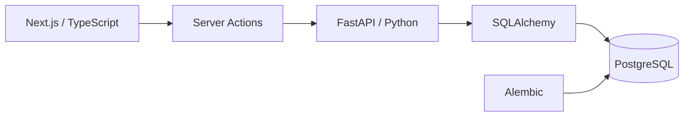

# CASE//ZERO

> A full-stack cybersecurity operations platform for alert triage, investigation, and case management.


---

## Overview

**CASE//ZERO** is a cybersecurity engineering project that models the workflow of a modern Security Operations Center.

The platform is being built as a connected investigation environment where analysts can review alerts, assign ownership, investigate suspicious activity, create cases, group related alerts, and track investigations through resolution.

Rather than functioning as a static dashboard, CASE//ZERO uses a real full-stack architecture with persistent security data and interactive analyst workflows.

```text
Security Events
      ↓
Detection
      ↓
Alerts
      ↓
Triage
      ↓
Investigation
      ↓
Cases
      ↓
Resolution
```

CASE//ZERO is currently under **active development**.

---

## Current Capabilities

### SOC Dashboard

The dashboard displays live application data including:

- API health
- PostgreSQL health
- Open alerts
- Critical alerts
- Recent alert activity
- Investigation metrics
- Platform module status

Dashboard metrics are calculated from backend data rather than static values.

---

### Alert Management

Security alerts support a persistent analyst workflow.

Current functionality includes:

- Create alerts through the API
- View all alerts
- Open individual alert details
- Severity classification
- Alert status tracking
- Analyst assignment
- Start investigations
- Resolve alerts
- Link alerts to cases
- Create cases directly from alerts
- Link alerts to existing cases
- Persistent PostgreSQL storage

Current lifecycle:

```text
NEW
 ↓
INVESTIGATING
 ↓
RESOLVED
```

Analyst actions flow through the full application stack:

```text
Next.js
   ↓
Server Actions
   ↓
FastAPI
   ↓
SQLAlchemy
   ↓
PostgreSQL
```

---

## Case Management

CASE//ZERO now includes a working Case Management interface.

Current functionality includes:

- Case list view
- Case detail view
- Case priority
- Case status
- Analyst ownership
- Linked alert count
- Linked alert table
- Case lifecycle actions
- Alert-to-case navigation
- Case-to-alert navigation
- Multiple alerts grouped under one case
- Create a case directly from an alert
- Add an alert to an existing active case

Current case lifecycle:

```text
OPEN
 ↓
INVESTIGATING
 ↓
RESOLVED
```

A case can contain multiple related security alerts:

```text
Investigation Case
        │
        ├── Alert A
        ├── Alert B
        └── Alert C
```

This allows related detections to be grouped into a single investigation rather than treating every alert as an isolated event.

---

## Alert-to-Case Workflow

CASE//ZERO currently supports an end-to-end analyst workflow entirely from the application interface.

```text
Alert Detected
      ↓
Assign to Me
      ↓
Start Investigation
      ↓
Create New Case
      OR
Link to Existing Case
      ↓
Case Investigation
      ↓
Linked Alerts
      ↓
Resolve Investigation
```

Alerts and cases are linked through a persistent PostgreSQL foreign-key relationship.

An analyst can navigate in both directions:

```text
Alert Detail
    ↓
View Case
    ↓
Case Detail
    ↓
Linked Alert
    ↓
Alert Detail
```

---

## Architecture



The application currently follows this flow:

```text
Frontend
   ↓
Next.js / React / TypeScript
   ↓
Server Actions
   ↓
FastAPI REST API
   ↓
Pydantic Validation
   ↓
SQLAlchemy ORM
   ↓
PostgreSQL
```

Database schema changes are managed independently through Alembic migrations.

---

## Technology Stack

| Area | Technology |
|---|---|
| Frontend | Next.js, React, TypeScript |
| Styling | Tailwind CSS |
| Backend | FastAPI, Python |
| Validation | Pydantic |
| ORM | SQLAlchemy |
| Database | PostgreSQL |
| Database Driver | Psycopg |
| Migrations | Alembic |
| Containers | Docker / Docker Compose |
| API Docs | Swagger / OpenAPI |
| Version Control | Git / GitHub |
| Development | VS Code |

---

## Current API

### Alerts

```text
GET    /api/alerts
POST   /api/alerts
GET    /api/alerts/{alert_id}
PATCH  /api/alerts/{alert_id}
POST   /api/alerts/{alert_id}/case
```

### Cases

```text
GET    /api/cases
POST   /api/cases
GET    /api/cases/{case_id}
PATCH  /api/cases/{case_id}
```

### Platform

```text
GET    /api/health
```

Interactive Swagger documentation is available while the backend is running:

```text
http://127.0.0.1:8000/docs
```

---

## Database

CASE//ZERO currently uses two core PostgreSQL tables:

```text
alerts
cases
```

### Alert Data

```text
id
title
description
severity
status
source
assigned_analyst
case_id
created_at
updated_at
```

### Case Data

```text
id
title
description
status
priority
assigned_analyst
created_at
updated_at
```

The alert `case_id` references `cases.id`.

```text
CASE
  │
  ├── Alert
  ├── Alert
  └── Alert
```

The relationship uses:

```text
ON DELETE SET NULL
```

so alerts remain preserved if their associated investigation case is removed.

---

## Repository Structure

```text
case-zero/
│
├── backend/
│   ├── alembic/
│   │   └── versions/
│   │
│   └── app/
│       ├── api/
│       │   └── routes/
│       │       ├── alerts.py
│       │       └── cases.py
│       │
│       ├── models/
│       │   ├── alert.py
│       │   ├── case.py
│       │   └── base.py
│       │
│       ├── schemas/
│       │   ├── alert.py
│       │   └── case.py
│       │
│       ├── database.py
│       └── main.py
│
├── frontend/
│   └── src/
│       ├── app/
│       │   ├── alerts/
│       │   │   ├── [id]/
│       │   │   └── page.tsx
│       │   │
│       │   ├── cases/
│       │   │   ├── [id]/
│       │   │   └── page.tsx
│       │   │
│       │   └── page.tsx
│       │
│       └── lib/
│           └── api.ts
│
├── compose.yaml
├── .env.example
├── .gitignore
└── README.md
```

---

## Running Locally

### Requirements

- Python 3.12+
- Node.js
- npm
- Docker Desktop
- Git

### 1. Clone

```bash
git clone https://github.com/danielguillaumont/case-zero.git
cd case-zero
```

### 2. Environment

Create the local environment file:

```powershell
Copy-Item .env.example .env
```

### 3. PostgreSQL

```bash
docker compose up -d postgres
```

### 4. Backend

```powershell
cd backend

python -m venv .venv

.\.venv\Scripts\Activate.ps1

pip install -r requirements.txt

alembic upgrade head

fastapi dev app\main.py
```

Backend:

```text
http://127.0.0.1:8000
```

Swagger:

```text
http://127.0.0.1:8000/docs
```

### 5. Frontend

Open another terminal:

```powershell
cd frontend

npm install

npm run dev
```

Frontend:

```text
http://localhost:3000
```

---

## Development Progress

### Completed

- [x] Full-stack project foundation
- [x] PostgreSQL development database
- [x] Docker development environment
- [x] SQLAlchemy ORM
- [x] Alembic migrations
- [x] API and database health checks
- [x] SOC dashboard
- [x] Alert API
- [x] Alert Management interface
- [x] Alert Detail interface
- [x] Alert lifecycle
- [x] Analyst assignment
- [x] Persistent alert state
- [x] Case database model
- [x] Case API
- [x] Cases frontend
- [x] Case Detail interface
- [x] Case lifecycle
- [x] Alert-to-case relationship
- [x] Create case from alert
- [x] Link alert to existing case
- [x] Multiple alerts per case
- [x] Bidirectional Alert ↔ Case navigation

### Current Focus

- [ ] Investigation notes
- [ ] Case activity timeline
- [ ] Case evidence / artifacts
- [ ] Improved case resolution workflow

### Planned

- [ ] Alert search and filtering
- [ ] Alert creation interface
- [ ] Security event ingestion
- [ ] Event normalization
- [ ] Detection rule engine
- [ ] Automatic alert generation
- [ ] MITRE ATT&CK mappings
- [ ] Threat hunting interface
- [ ] Threat intelligence
- [ ] Investigation playbooks
- [ ] Authentication
- [ ] Role-based access control
- [ ] Automated testing
- [ ] CI/CD
- [ ] Production deployment

---

## Planned Platform Flow

The long-term CASE//ZERO architecture is intended to support:

```text
Security Telemetry
        ↓
Event Ingestion
        ↓
Event Normalization
        ↓
Detection Rules
        ↓
Alert Generation
        ↓
Analyst Triage
        ↓
Investigation Case
        ↓
Linked Alerts
        ↓
Investigation Notes
        ↓
Threat Hunting / Enrichment
        ↓
Evidence & Findings
        ↓
Resolution
```

---

## Project Goals

CASE//ZERO is being developed to explore both cybersecurity operations and the software engineering behind modern security platforms.

The project focuses on practical concepts including:

- Security alert triage
- Incident investigation
- Case management
- Detection engineering
- Threat hunting
- Security automation
- SOC workflow design
- REST API development
- Relational database design
- Full-stack application development
- Containerized environments
- Database migrations
- Persistent analyst workflows

---

## Current Status

CASE//ZERO has progressed beyond a static SOC dashboard prototype.

The platform currently supports:

```text
Live Dashboard
      +
Persistent Alerts
      +
Analyst Assignment
      +
Alert Investigation
      +
Case Management
      +
Case Lifecycle
      +
Alert-to-Case Linking
      +
Multiple Alerts per Case
      +
Bidirectional Investigation Navigation
```

The current development focus is turning the Case Detail page into a deeper analyst workspace by adding **persistent investigation notes and activity history**.

After the Case Management module is more complete, development will move toward the **Security Event Pipeline** and **Detection Engine**.

---

## Disclaimer

CASE//ZERO is an independent educational and portfolio project designed to simulate cybersecurity operations workflows.

It is not intended to replace a production SIEM, SOAR, EDR, threat intelligence platform, or enterprise incident-response system.