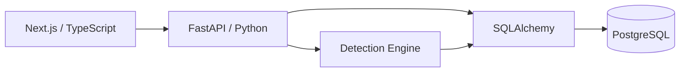

# CASE//ZERO

> A full-stack cybersecurity operations platform for detection, investigation, threat hunting, and incident response.


---

## Overview

**CASE//ZERO** is a portfolio cybersecurity engineering project that models the workflow of a modern Security Operations Center.

It combines security telemetry, detection engineering, alert triage, case management, threat hunting, response playbooks, and threat intelligence in one connected investigation platform.

```text
Security Events
      ↓
Detection Rules
      ↓
Alerts
      ↓
Investigation
   ↙       ↘
Threat Hunt   Playbook
      ↓
Threat Intelligence
      ↓
Investigation Case
```

---

## Current Capabilities

### Security Events
- Normalized security-event ingestion
- Endpoint and authentication telemetry
- Event explorer and detail views
- Raw event evidence
- Event-to-alert navigation

### Detection Engine
- Single-event detections
- Multi-event correlation
- Automatic alert generation
- Detection-rule provenance stored on alerts

Current rules include:

- Encoded PowerShell
- PowerShell Download Cradle
- Authentication Brute Force

### Alert Investigation
- Alert lifecycle and analyst assignment
- Detection evidence
- Linked source events
- Linked detection rules
- Recommended response playbooks
- Case creation and linking

### Case Management
- Investigation cases
- Analyst ownership
- Priority and lifecycle tracking
- Linked alerts
- Investigation notes
- Activity timeline

### Threat Hunting
- Structured telemetry queries
- Free-text searches
- Host, user, IP, process, source, and event filters
- Direct navigation into event evidence

### Detection Rules & Playbooks
- Rule catalog and detail views
- Detection logic visibility
- Rule-to-playbook mapping
- Ordered response procedures
- Bidirectional Rule ↔ Playbook navigation

### Threat Intelligence
- Persistent IOC registry
- IP, domain, URL, and hash indicators
- Reputation and confidence scoring
- Tags and analyst context
- Search and filtering
- IOC detail pages
- Correlation against related security events

---

## Investigation Flow

CASE//ZERO now supports a connected analyst workflow:

```text
Telemetry
   ↓
Detection Engine
   ↓
Detection Rule
   ↓
Alert
   ├── Source Evidence
   ├── Threat Intelligence
   ├── Response Playbook
   ├── Threat Hunt
   └── Investigation Case
```

---

## Technology Stack

| Area | Technology |
|---|---|
| Frontend | Next.js, React, TypeScript |
| Styling | Tailwind CSS |
| Backend | FastAPI, Python |
| Validation | Pydantic |
| ORM | SQLAlchemy |
| Database | PostgreSQL |
| Migrations | Alembic |
| Containers | Docker / Docker Compose |
| API Docs | Swagger / OpenAPI |
| Version Control | Git / GitHub |

---

## Architecture



Core API modules:

```text
/api/events
/api/alerts
/api/cases
/api/hunt
/api/rules
/api/playbooks
/api/intelligence
```

---

## Running Locally

### Requirements

- Python 3.12+
- Node.js / npm
- Docker Desktop
- Git

### Clone

```bash
git clone https://github.com/danielguillaumont/case-zero.git
cd case-zero
```

### Environment

```powershell
Copy-Item .env.example .env
```

### PostgreSQL

```powershell
docker compose up -d postgres
```

### Backend

```powershell
cd backend

python -m venv .venv
.\.venv\Scripts\Activate.ps1

pip install -r requirements.txt
alembic upgrade head

fastapi dev app\main.py
```

Backend:

```text
http://127.0.0.1:8000
```

Swagger:

```text
http://127.0.0.1:8000/docs
```

### Frontend

In another terminal:

```powershell
cd frontend
npm install
npm run dev
```

Frontend:

```text
http://localhost:3000
```

---

## Development Status

### Implemented

- [x] Full-stack application architecture
- [x] PostgreSQL persistence and migrations
- [x] SOC dashboard
- [x] Security-event ingestion
- [x] Security Event Explorer
- [x] Detection engine
- [x] Automatic alert generation
- [x] Correlation detection
- [x] Alert investigation workflow
- [x] Case management
- [x] Investigation notes
- [x] Case activity timeline
- [x] Threat hunting
- [x] Detection Rules workspace
- [x] Incident Response Playbooks
- [x] Rule ↔ Alert ↔ Playbook navigation
- [x] Threat Intelligence registry
- [x] IOC-to-event correlation

### Next

- [ ] Alert-to-IOC intelligence matching
- [ ] MITRE ATT&CK mappings
- [ ] Additional detections and telemetry types
- [ ] Authentication and role-based access control
- [ ] Automated tests
- [ ] CI/CD
- [ ] Production deployment and hardening

---

## Project Goal

CASE//ZERO is designed to demonstrate both **defensive cybersecurity concepts** and the **software engineering behind security platforms**, including detection engineering, incident response, threat hunting, security automation, API development, relational data modeling, and full-stack application design.

---

## Disclaimer

CASE//ZERO is an independent educational and portfolio project designed to simulate cybersecurity operations workflows.

It is not intended to replace a production SIEM, SOAR, EDR, threat-intelligence platform, or enterprise incident-response system.