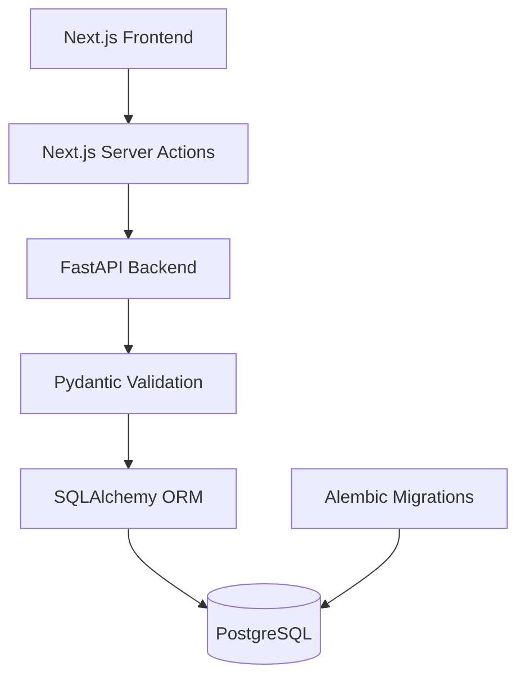

# CASE//ZERO

> A full-stack cybersecurity operations and investigation platform built to simulate modern SOC workflows from alert triage through case investigation.


---

## Overview

**CASE//ZERO** is a cybersecurity engineering portfolio project designed to model the workflow of a modern Security Operations Center.

Rather than functioning as a static dashboard, CASE//ZERO is being built as a connected security platform where analysts can review alerts, assign ownership, investigate suspicious activity, manage alert status, and escalate related activity into investigation cases.

The project combines a modern web interface with a FastAPI backend, PostgreSQL persistence, SQLAlchemy models, Alembic database migrations, and security-focused workflow logic.

The long-term goal is to build a realistic end-to-end security operations flow:

```text
Security Telemetry
        ↓
Event Ingestion
        ↓
Detection Rules
        ↓
Security Alerts
        ↓
Analyst Triage
        ↓
Investigation
        ↓
Case Management
        ↓
Threat Hunting / Intelligence
        ↓
Resolution
```

CASE//ZERO is currently under **active development**.

---

## Current Capabilities

### Security Dashboard

CASE//ZERO includes a SOC-style operational dashboard backed by live application data.

Current dashboard functionality includes:

- FastAPI service health monitoring
- PostgreSQL database health monitoring
- Open alert count
- Critical alert count
- Recent alert activity
- Investigation metrics
- Platform module status
- Navigation into alert workflows

Dashboard alert metrics are calculated from backend data rather than static placeholder values.

---

### Alert Management

CASE//ZERO currently provides a persistent security alert workflow across the frontend, backend, and database.

Current alert functionality includes:

- Create security alerts through the API
- Retrieve all alerts
- Retrieve individual alerts
- Update existing alerts
- Severity classification
- Alert status tracking
- Analyst assignment
- Alert investigation view
- Persistent PostgreSQL storage
- Alert-to-case relationships
- Dynamic alert metrics

Current alert lifecycle:

```text
NEW
 ↓
INVESTIGATING
 ↓
RESOLVED
```

The backend currently exposes:

```text
GET    /api/alerts
POST   /api/alerts
GET    /api/alerts/{alert_id}
PATCH  /api/alerts/{alert_id}
```

---

## Analyst Investigation Workflow

Security alerts can be opened from the CASE//ZERO interface and investigated through an interactive analyst workflow.

Current workflow:

```text
Open Alert
    ↓
Assign to Me
    ↓
Start Investigation
    ↓
Investigate Alert
    ↓
Resolve Alert
```

Changes made through the frontend are persisted through the complete application stack:

```text
Next.js UI
    ↓
Server Action
    ↓
FastAPI
    ↓
SQLAlchemy
    ↓
PostgreSQL
    ↓
Updated CASE//ZERO UI
```

This means investigation actions are not simulated frontend state. They modify persistent records stored in PostgreSQL.

---

## Analyst Assignment

Alerts support persistent analyst ownership.

Example:

```text
Assigned Analyst
Daniel Guillaumont

Assigned to you
```

The current development version uses a fixed analyst identity for the **Assign to Me** workflow.

A future authentication and role-based access control system will replace this temporary development identity with authenticated CASE//ZERO users.

---

## Investigation Cases

CASE//ZERO now includes the backend foundation for investigation case management.

Current case functionality includes:

- Create investigation cases
- Retrieve all cases
- Retrieve individual cases
- Update existing cases
- Case status
- Case priority
- Analyst ownership
- Persistent PostgreSQL storage
- Alert-to-case relationships
- Multiple alerts capable of referencing the same investigation case

Current API endpoints:

```text
GET    /api/cases
POST   /api/cases
GET    /api/cases/{case_id}
PATCH  /api/cases/{case_id}
```

The database relationship currently follows this model:

```text
                  ┌────────────────────────┐
                  │          CASE          │
                  │                        │
                  │ id                     │
                  │ title                  │
                  │ status                 │
                  │ priority               │
                  │ assigned_analyst       │
                  └────────────┬───────────┘
                               │
                               │
                ┌──────────────┼──────────────┐
                │              │              │
                ▼              ▼              ▼
             Alert A        Alert B        Alert C
```

Alerts contain a nullable:

```text
case_id
```

foreign key referencing:

```text
cases.id
```

The relationship uses:

```text
ON DELETE SET NULL
```

so deleting a case does not destroy the underlying security alerts.

---

## Architecture



CASE//ZERO currently follows a layered full-stack architecture:

```text
Frontend
   ↓
Next.js / React / TypeScript
   ↓
Server Actions
   ↓
FastAPI REST API
   ↓
Pydantic Validation
   ↓
SQLAlchemy ORM
   ↓
PostgreSQL
```

Database schema changes are independently managed through:

```text
Alembic
   ↓
PostgreSQL Migrations
```

---

## Frontend

The CASE//ZERO frontend is built with:

- Next.js
- React
- TypeScript
- Tailwind CSS
- Next.js Server Actions

Current frontend functionality includes:

```text
Dashboard
Alerts
Alert Management
Alert Detail
Investigation Workflow
Analyst Assignment
```

Additional modules are represented in the interface and will become functional as development continues:

```text
Cases
Hunt
Intelligence
Rules
Playbooks
Administration
```

---

## Backend

The backend is built with:

- Python
- FastAPI
- Pydantic
- SQLAlchemy
- Psycopg
- Alembic

Current backend responsibilities include:

- REST API routing
- Request validation
- Response serialization
- Alert management
- Case management
- Analyst assignment
- Investigation status management
- Alert-to-case linking
- PostgreSQL interaction
- Service health checks

Interactive Swagger/OpenAPI documentation is available while the backend is running.

```text
http://127.0.0.1:8000/docs
```

---

## Database

CASE//ZERO uses PostgreSQL as its persistent data store.

Current core tables:

```text
alerts
cases
```

### Alerts

Current alert data includes:

```text
id
title
description
severity
status
source
assigned_analyst
case_id
created_at
updated_at
```

### Cases

Current case data includes:

```text
id
title
description
status
priority
assigned_analyst
created_at
updated_at
```

---

## Database Migrations

Database schema changes are managed using **Alembic** rather than manual database modifications.

Current migration history includes:

```text
Create Alerts Table
        ↓
Add Alert Analyst Assignment
        ↓
Add Investigation Cases
        ↓
Add Alert-to-Case Relationship
```

This allows the database schema to evolve alongside application development while maintaining reproducible migration history.

---

## Technology Stack

| Layer | Technology |
|---|---|
| Frontend | Next.js, React, TypeScript |
| Styling | Tailwind CSS |
| Backend | FastAPI, Python |
| API Validation | Pydantic |
| ORM | SQLAlchemy |
| Database | PostgreSQL |
| Database Driver | Psycopg |
| Migrations | Alembic |
| Containers | Docker / Docker Compose |
| API Documentation | Swagger / OpenAPI |
| Version Control | Git / GitHub |
| Development Environment | VS Code |

---

## Repository Structure

```text
case-zero/
│
├── backend/
│   │
│   ├── alembic/
│   │   ├── versions/
│   │   └── env.py
│   │
│   ├── app/
│   │   │
│   │   ├── api/
│   │   │   └── routes/
│   │   │       ├── alerts.py
│   │   │       └── cases.py
│   │   │
│   │   ├── models/
│   │   │   ├── alert.py
│   │   │   ├── base.py
│   │   │   └── case.py
│   │   │
│   │   ├── schemas/
│   │   │   ├── alert.py
│   │   │   └── case.py
│   │   │
│   │   ├── config.py
│   │   ├── database.py
│   │   └── main.py
│   │
│   ├── alembic.ini
│   └── requirements.txt
│
├── frontend/
│   │
│   ├── public/
│   │
│   └── src/
│       │
│       ├── app/
│       │   │
│       │   ├── alerts/
│       │   │   │
│       │   │   ├── [id]/
│       │   │   │   ├── actions.ts
│       │   │   │   └── page.tsx
│       │   │   │
│       │   │   └── page.tsx
│       │   │
│       │   ├── layout.tsx
│       │   ├── globals.css
│       │   └── page.tsx
│       │
│       └── lib/
│           └── api.ts
│
├── compose.yaml
├── .env.example
├── .gitignore
└── README.md
```

---

# Running CASE//ZERO Locally

## Prerequisites

Install the following before running CASE//ZERO:

- Git
- Python 3.12+
- Node.js
- npm
- Docker Desktop

---

## 1. Clone the Repository

```bash
git clone https://github.com/danielguillaumont/case-zero.git

cd case-zero
```

---

## 2. Configure Environment Variables

Create a local `.env` file from the provided example:

```powershell
Copy-Item .env.example .env
```

The local PostgreSQL development environment uses values similar to:

```env
POSTGRES_USER=casezero
POSTGRES_PASSWORD=casezero_dev_password
POSTGRES_DB=casezero
```

The real `.env` file should remain local and should **not** be committed to Git.

---

## 3. Start PostgreSQL

From the project root:

```bash
docker compose up -d postgres
```

Verify the database container:

```bash
docker compose ps
```

---

## 4. Configure the Backend

Move into the backend directory:

```powershell
cd backend
```

Create the Python virtual environment:

```powershell
python -m venv .venv
```

Activate it:

```powershell
.\.venv\Scripts\Activate.ps1
```

Install dependencies:

```powershell
pip install -r requirements.txt
```

Apply database migrations:

```powershell
alembic upgrade head
```

Start FastAPI:

```powershell
fastapi dev app\main.py
```

The backend will be available at:

```text
http://127.0.0.1:8000
```

Interactive Swagger documentation:

```text
http://127.0.0.1:8000/docs
```

---

## 5. Configure the Frontend

Open a separate terminal and move into the frontend directory:

```powershell
cd frontend
```

Install dependencies:

```powershell
npm install
```

Start the development server:

```powershell
npm run dev
```

The CASE//ZERO interface will be available at:

```text
http://localhost:3000
```

---

# Example Alert Investigation

A typical CASE//ZERO alert workflow currently looks like:

```text
Possible Brute Force Attack

Severity: HIGH
Status: NEW

        ↓

Assign to Me

        ↓

Assigned Analyst:
Daniel Guillaumont

        ↓

Start Investigation

        ↓

Status:
INVESTIGATING

        ↓

Link Investigation Case

        ↓

Resolve Alert

        ↓

Status:
RESOLVED
```

---

# Example Alert-to-Case Relationship

CASE//ZERO can associate a security alert with an investigation case.

Example:

```text
CASE
Suspicious Administrative Authentication Activity

Priority: HIGH
Status: OPEN
Assigned Analyst: Daniel Guillaumont

                    ▲
                    │
                    │ case_id
                    │

ALERT
Possible Brute Force Attack

Severity: HIGH
Status: RESOLVED
Assigned Analyst: Daniel Guillaumont
```

This provides the foundation for grouping related detections into a larger security investigation.

---

# Development Roadmap

## Phase 1 — Platform Foundation

- [x] Git repository
- [x] GitHub repository
- [x] FastAPI backend
- [x] Next.js frontend
- [x] PostgreSQL database
- [x] Docker development database
- [x] SQLAlchemy ORM
- [x] Pydantic validation
- [x] Alembic migrations
- [x] API health monitoring
- [x] Database health monitoring

---

## Phase 2 — Alert Operations

- [x] Alert database model
- [x] Alert creation API
- [x] Alert listing API
- [x] Individual alert API
- [x] Alert update API
- [x] Alert list interface
- [x] Alert detail interface
- [x] Severity classification
- [x] Alert lifecycle
- [x] Analyst assignment
- [x] Persistent investigation state
- [x] Alert-to-case database relationship
- [x] Alert-to-case API linking
- [ ] Alert search
- [ ] Severity filtering
- [ ] Status filtering
- [ ] Sorting
- [ ] Pagination
- [ ] Bulk alert actions
- [ ] Alert history / audit trail
- [ ] Reopen alert workflow

---

## Phase 3 — Case Management

- [x] Case database model
- [x] Case database migration
- [x] Case creation API
- [x] Case listing API
- [x] Individual case API
- [x] Case update API
- [x] Case priority
- [x] Case status
- [x] Case analyst ownership
- [x] Alert-to-case relationship
- [x] Alert linking through API
- [ ] Return linked alerts with case details
- [ ] Cases frontend page
- [ ] Case detail page
- [ ] Create case directly from an alert
- [ ] Add additional alerts to an existing case
- [ ] Remove alert from case
- [ ] Investigation notes
- [ ] Evidence / artifacts
- [ ] Investigation timeline
- [ ] Case activity history
- [ ] Case resolution workflow

---

## Phase 4 — Security Event Pipeline

- [ ] Security event database model
- [ ] Event ingestion API
- [ ] Event normalization
- [ ] Event timestamps
- [ ] Event source tracking
- [ ] Authentication telemetry
- [ ] Endpoint telemetry
- [ ] Network telemetry
- [ ] Cloud telemetry
- [ ] Synthetic security event generation
- [ ] Event processing pipeline

---

## Phase 5 — Detection Engine

- [ ] Detection rule database model
- [ ] Detection rule API
- [ ] Rule management interface
- [ ] Enable / disable rules
- [ ] Detection severity
- [ ] Rule evaluation engine
- [ ] Automatic alert creation
- [ ] Detection metadata
- [ ] MITRE ATT&CK mappings
- [ ] Rule execution history

Example future rules:

```text
CZ-AUTH-001
Brute Force Authentication

CZ-ENDPOINT-002
Encoded PowerShell Execution

CZ-CLOUD-003
Impossible Travel

CZ-NETWORK-004
Known Command-and-Control Communication
```

---

## Phase 6 — Threat Hunting

- [ ] Hunt interface
- [ ] Security event search
- [ ] Query filtering
- [ ] Time-range filtering
- [ ] Host filtering
- [ ] User filtering
- [ ] IP filtering
- [ ] Event source filtering
- [ ] Hunt result table
- [ ] Entity pivoting
- [ ] Create investigation from hunt results

Future example:

```text
user = administrator
AND
event_type = authentication
AND
result = failure
```

---

## Phase 7 — Threat Intelligence

- [ ] Indicator database model
- [ ] Indicator API
- [ ] IP address indicators
- [ ] Domain indicators
- [ ] URL indicators
- [ ] File hashes
- [ ] Email indicators
- [ ] Threat confidence scoring
- [ ] Indicator tagging
- [ ] Threat intelligence enrichment
- [ ] Alert / IOC correlation
- [ ] External intelligence integrations

---

## Phase 8 — Playbooks and Automation

- [ ] Investigation playbooks
- [ ] Playbook steps
- [ ] Automated enrichment
- [ ] Workflow automation
- [ ] Analyst response actions
- [ ] Phishing investigation playbook
- [ ] Endpoint investigation playbook
- [ ] Authentication investigation playbook

Example future phishing workflow:

```text
Reported Email
      ↓
Inspect Sender
      ↓
Extract URLs
      ↓
Extract Attachments
      ↓
Check Indicators
      ↓
Search Related Users
      ↓
Determine Verdict
      ↓
Contain / Resolve
```

---

## Phase 9 — Platform Administration

- [ ] Authentication
- [ ] User accounts
- [ ] Analyst profiles
- [ ] Role-based access control
- [ ] Administrator role
- [ ] Analyst role
- [ ] Read-only role
- [ ] User management
- [ ] Platform configuration

---

## Phase 10 — Production Engineering

- [ ] Backend unit tests
- [ ] API integration tests
- [ ] Frontend tests
- [ ] End-to-end workflow testing
- [ ] CI/CD pipeline
- [ ] Full application containerization
- [ ] Production Docker configuration
- [ ] Centralized logging
- [ ] Application observability
- [ ] Error monitoring
- [ ] Security hardening
- [ ] Secrets management
- [ ] Public demo deployment

---

# Planned Full Investigation Workflow

The long-term CASE//ZERO workflow is designed to operate approximately like this:

```text
1. Security telemetry is generated

                 ↓

2. CASE//ZERO ingests security events

                 ↓

3. Detection rules evaluate telemetry

                 ↓

4. Suspicious activity generates an alert

                 ↓

5. Analyst reviews the alert

                 ↓

6. Analyst assigns the alert

                 ↓

7. Analyst starts investigation

                 ↓

8. Alert is promoted or linked to a case

                 ↓

9. Analyst searches related telemetry

                 ↓

10. Additional alerts and evidence are linked

                 ↓

11. Indicators are enriched with threat intelligence

                 ↓

12. Analyst documents investigation findings

                 ↓

13. Investigation is resolved

                 ↓

14. Dashboard and operational metrics update
```

---

# Project Goals

CASE//ZERO is intended to demonstrate practical experience across both cybersecurity and software engineering.

Core areas include:

### Cybersecurity

- Security operations
- Alert triage
- Incident investigation
- Case management
- Detection engineering
- Threat hunting
- Threat intelligence
- Security automation
- Security telemetry
- Analyst workflow design
- MITRE ATT&CK concepts

### Backend Engineering

- REST API design
- Python
- FastAPI
- Pydantic validation
- SQLAlchemy
- PostgreSQL
- Database relationships
- Schema migrations
- Asynchronous database operations

### Frontend Engineering

- Next.js
- React
- TypeScript
- Server Actions
- Dynamic routing
- State-driven security interfaces
- SOC-style dashboard design

### DevOps / Platform Engineering

- Git
- GitHub
- Docker
- Docker Compose
- Environment configuration
- Database migrations
- Incremental development
- CI/CD planning

---

# Current Project Status

CASE//ZERO has progressed beyond a static interface prototype.

The application currently has a functioning full-stack architecture with persistent state and real analyst workflows.

Currently implemented:

```text
Next.js SOC Interface
        ↓
FastAPI Backend
        ↓
Pydantic Validation
        ↓
SQLAlchemy ORM
        ↓
PostgreSQL Database
```

Working security functionality currently includes:

```text
Dashboard Monitoring
        +
Alert Management
        +
Alert Investigation
        +
Analyst Assignment
        +
Alert Lifecycle Management
        +
Case Management API
        +
Alert-to-Case Relationships
```

The current development focus is completing the **Case Management frontend and investigation workflow**.

After Case Management, development will move toward the **Security Event Pipeline** and **Detection Engine**.

---

# Why CASE//ZERO?

CASE//ZERO is being developed to explore how security operations platforms work beneath the interface.

Instead of only interacting with existing security tools, the project focuses on engineering the underlying concepts:

```text
How are alerts represented?

How are investigations tracked?

How are analysts assigned?

How is security state persisted?

How are related alerts grouped?

How do detection rules create alerts?

How can telemetry be searched during investigations?

How can security workflows be automated?
```

The goal is to combine cybersecurity operations knowledge with practical software engineering by building those workflows directly.

---

# Disclaimer

CASE//ZERO is an independently developed educational and portfolio project.

It is designed to simulate cybersecurity operations, detection, investigation, and case-management concepts.

CASE//ZERO is **not currently intended to replace a production SIEM, SOAR, EDR, threat intelligence platform, or enterprise incident-response system**.