# **CASE//ZERO**

> **Investigate. Correlate. Respond.**  
> A full-stack cybersecurity operations platform for detection engineering, alert triage, investigation, threat hunting, threat intelligence, and incident response.

[](https://github.com/danielguillaumont/case-zero/releases)


[](https://github.com/danielguillaumont/case-zero/actions/workflows/ci.yml)

**Live Application:**  
https://case-zero-nine.vercel.app

**Current Release:** `v2.0.1` — CASE//ZERO UI V2 Production Patch

---

## **Overview**

**CASE//ZERO** is a full-stack cybersecurity engineering project that simulates the workflow of a modern Security Operations Center.

Rather than building isolated dashboards, the project connects the pieces of an investigation into one workflow:

```text
Telemetry
   ↓
Detection Rules
   ↓
Alerts
   ↓
Triage & Analyst Ownership
   ↓
Investigation Cases
   ↓
Evidence + Notes + Activity
   ↓
Threat Hunting
   ↓
Response Playbooks
```

The platform combines:

- Security event telemetry
- Detection engineering
- Automated alert generation
- Alert triage
- Analyst assignment
- Case management
- Investigation timelines
- Threat hunting
- Threat intelligence
- MITRE ATT&CK context
- Response playbooks
- Authentication and RBAC
- PostgreSQL persistence
- Automated testing
- CI/CD
- Multi-service cloud deployment

The goal was to build something that feels less like a collection of portfolio pages and more like a **small operational security product**.

---

# **Product Walkthrough**

## **1. Enter the Analyst Workspace**

CASE//ZERO begins with an authenticated analyst gateway.

The interface establishes the core idea behind the platform immediately:

> **Investigate. Correlate. Respond.**

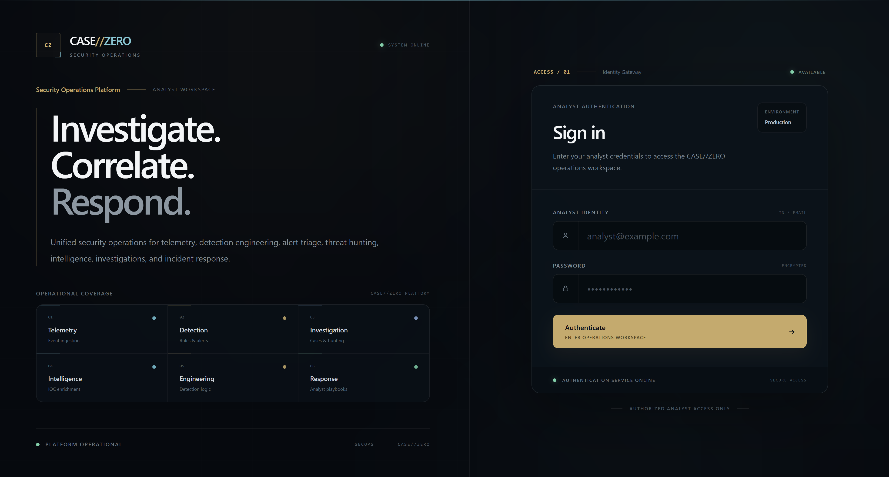

Authentication is backed by PostgreSQL user accounts, Argon2 password hashing, JWT access tokens, HttpOnly sessions, persistent login throttling, and role-based authorization.

Once authenticated, analysts enter the protected security operations workspace.

---

## **2. Understand the Environment**

The **Operational Overview** acts as the analyst's starting point.

It provides a quick view of:

- Open alerts
- Active investigations
- Critical detections
- Recent telemetry
- Alert severity distribution
- Analyst workload
- Current platform state

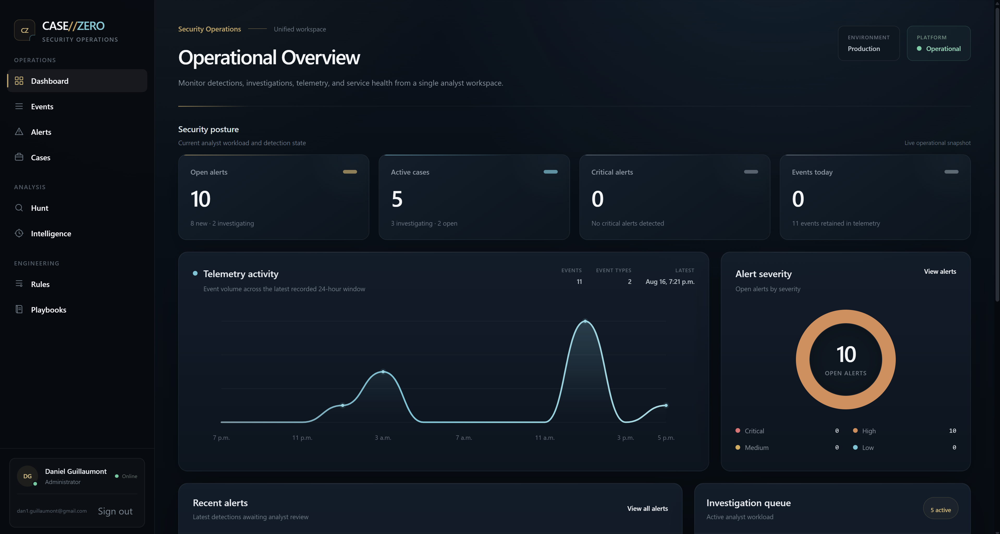

This page is intentionally designed as an operational surface rather than a static metrics dashboard.

The numbers are connected to the same alerts, cases, events, and investigations available throughout the rest of the platform.

---

# **Investigation Story: Encoded PowerShell**

The strongest way to understand CASE//ZERO is to follow an investigation through the platform.

In this example, endpoint telemetry contains an encoded PowerShell command.

CASE//ZERO evaluates the event against detection logic, produces an alert, and gives the analyst multiple ways to investigate and respond.

---

## **3. Triage the Alert Queue**

The **Alert Management** workspace provides the main triage queue.

Analysts can review detections by:

- Severity
- Workflow status
- Detection source
- Assigned analyst
- Creation time

The queue also supports search and filtering for faster triage.

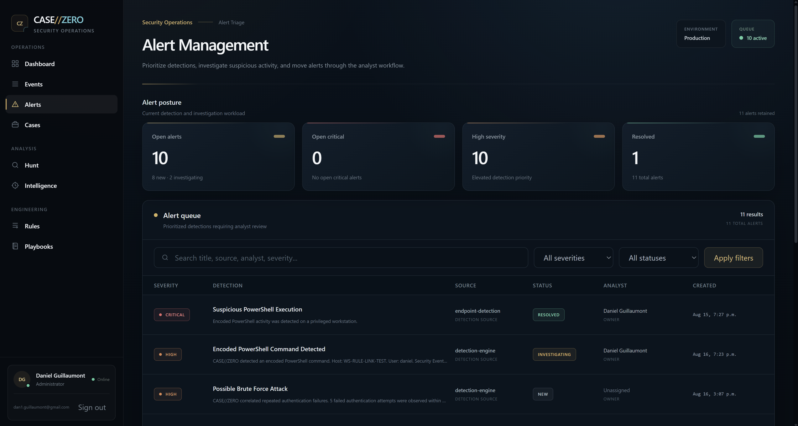

Here, the **Encoded PowerShell Command Detected** alert has moved into an active investigation.

---

## **4. Take Ownership and Begin Investigation**

Opening the detection reveals a dedicated analyst workspace.

The alert record brings together:

- Severity
- Workflow state
- Analyst ownership
- Linked investigation case
- Detection summary
- Source event
- Detection rule
- MITRE ATT&CK context
- Recommended response procedure

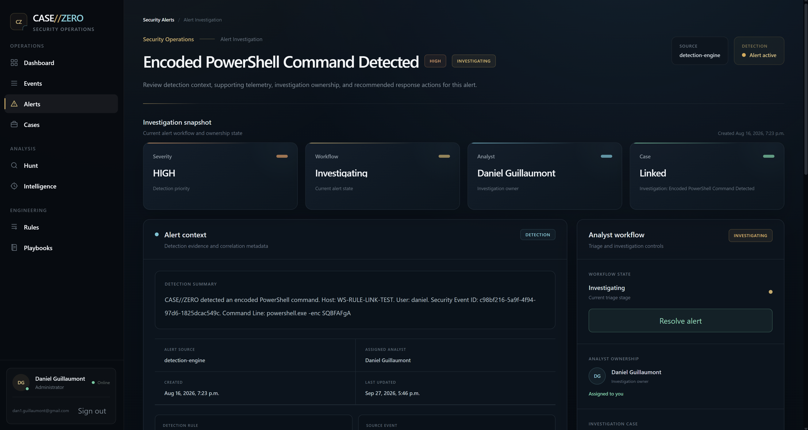

The analyst can take ownership of the alert and move it from:

```text
NEW
 ↓
INVESTIGATING
 ↓
RESOLVED
```

This workflow is persisted through the FastAPI backend rather than existing only in frontend state.

The alert in this example is assigned to **Daniel Guillaumont**, moved into `INVESTIGATING`, and linked to an investigation case.

---

## **5. Escalate the Alert Into a Case**

An alert can be escalated into a structured investigation.

The generated case maintains the relationship to the original detection while introducing a separate investigation lifecycle.

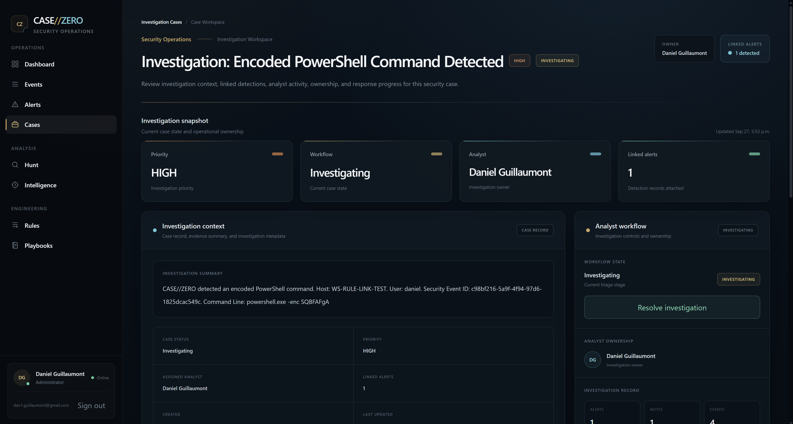

The case workspace tracks:

- Priority
- Investigation status
- Analyst ownership
- Linked alerts
- Investigation context
- Activity history
- Analyst notes
- Related security events

This creates a separation between an individual detection and the broader analyst investigation.

```text
Detection
    ↓
Alert
    ↓
Investigation Case
    ↓
Evidence + Analyst Decisions
```

---

## **6. Maintain an Investigation Timeline**

CASE//ZERO records investigation activity as the case evolves.

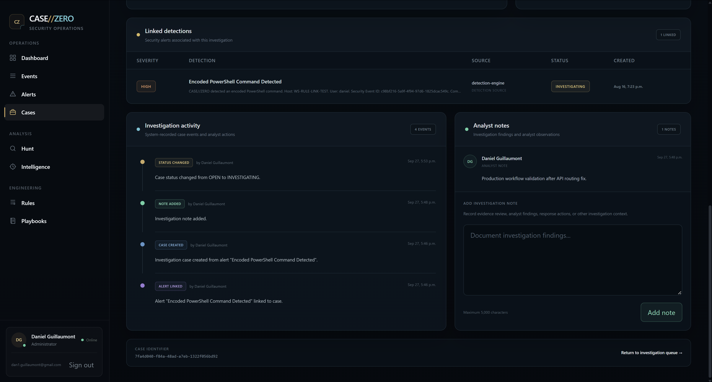

The activity timeline can record events such as:

```text
Alert linked
     ↓
Case created
     ↓
Analyst note added
     ↓
Status changed
```

Analysts can also add investigation notes directly to the case.

That allows the case to preserve not only technical evidence, but also the analyst's reasoning and actions over time.

This is important because a real investigation is more than a status field. It is a sequence of decisions.

---

# **Hunt Beyond the Initial Detection**

An alert answers:

> **What did the detection engine find?**

Threat hunting asks:

> **What else might be happening?**

---

## **7. Build a Threat Hunt**

CASE//ZERO includes a dedicated hunting workspace for searching normalized telemetry.

In this example, the analyst searches for:

```text
powershell
```

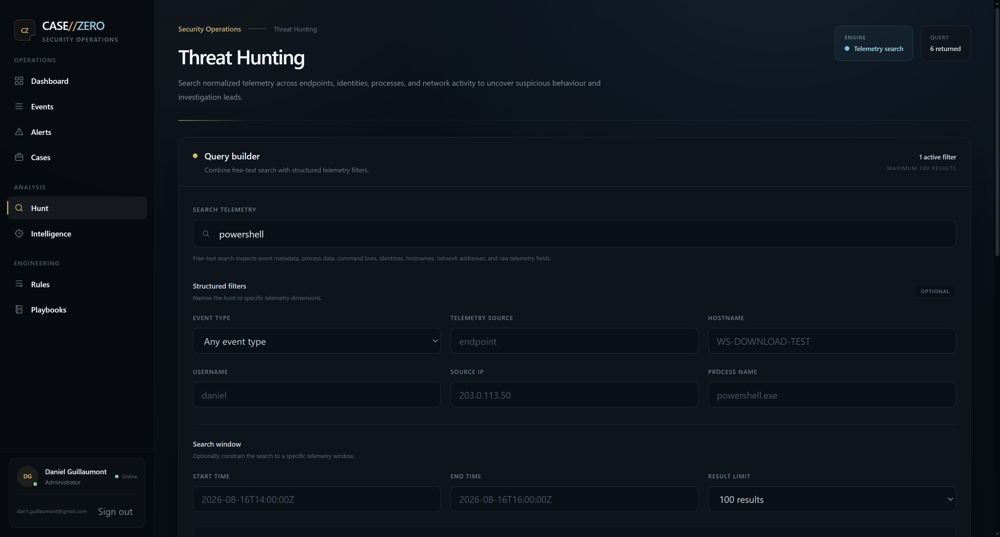

The hunting engine supports free-text searches alongside structured filters such as:

- Event type
- Telemetry source
- Hostname
- Username
- Source IP
- Process name
- Start time
- End time
- Result limit

This allows an analyst to pivot from a single detection into the surrounding environment.

---

## **8. Review Related Telemetry**

The PowerShell hunt returns multiple matching telemetry records across several endpoints.

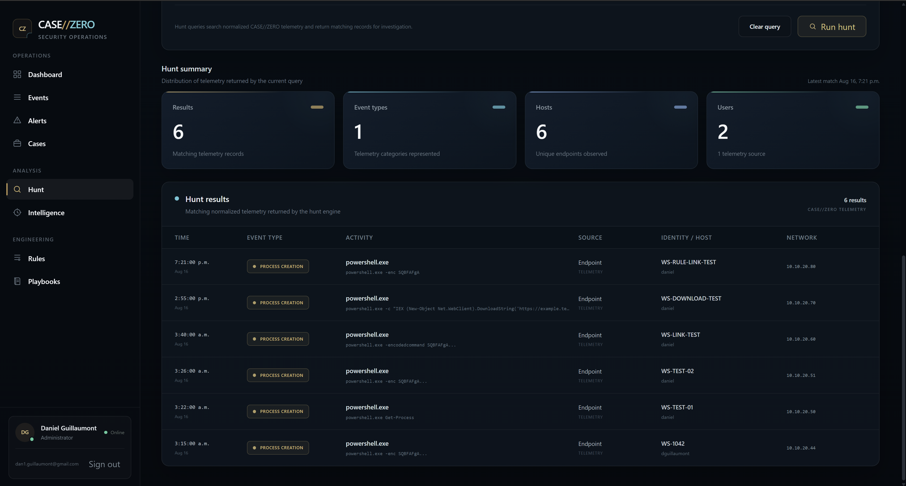

The results summarize:

- Matching events
- Event types
- Unique hosts
- Users
- Network information
- Process information

Each result can be opened for deeper analysis.

The workflow becomes:

```text
Alert
  ↓
Suspicious Activity
  ↓
Threat Hunt
  ↓
Related Telemetry
  ↓
Additional Investigation Leads
```

---

# **Evidence and Detection Engineering**

CASE//ZERO allows the analyst to move backward from the alert into the evidence that caused it.

This is where detection, telemetry, and investigation become connected rather than isolated modules.

---

## **9. Inspect the Original Security Event**

The **Event Investigation** workspace exposes the normalized telemetry behind the detection.

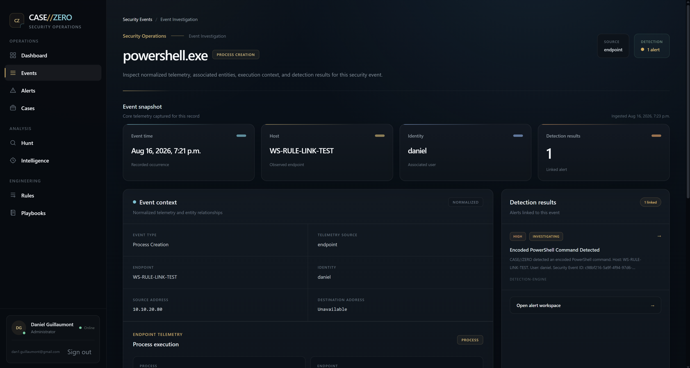

The example PowerShell event includes:

- Event timestamp
- Endpoint
- Identity
- Source address
- Event type
- Telemetry source
- Process execution
- Linked detection result

The event shows that the PowerShell telemetry produced a linked alert.

```text
powershell.exe
      ↓
Normalized Process Event
      ↓
Detection Evaluation
      ↓
Encoded PowerShell Alert
```

This gives the analyst a direct pivot between raw evidence and the resulting detection.

---

## **10. Inspect the Detection Logic**

The analyst can also pivot directly into the rule responsible for the alert.

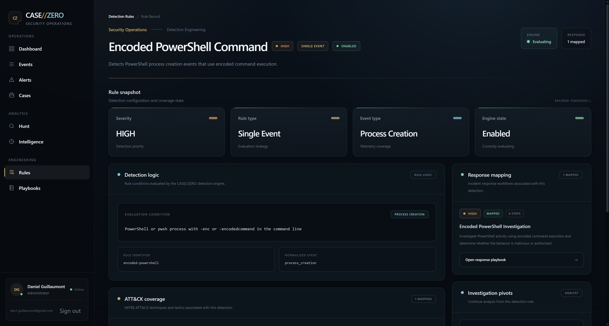

The **Encoded PowerShell Command** rule exposes:

- Severity
- Rule type
- Event coverage
- Engine state
- Evaluation condition
- Rule identifier
- Normalized event type
- MITRE ATT&CK mapping
- Response-playbook mapping

The detection condition for this example evaluates PowerShell process creation events for encoded command execution.

Conceptually:

```text
Process Creation Event
        ↓
PowerShell / pwsh
        ↓
Encoded-command indicator
        ↓
Rule Match
        ↓
Alert
```

This makes detection engineering visible to the analyst instead of treating the detection engine as a black box.

---

# **Response Engineering**

Finding suspicious activity is only part of the job.

CASE//ZERO also maps detections to structured analyst response procedures.

---

## **11. Open the Response Library**

The **Incident Response Playbooks** workspace contains reusable procedures associated with detection rules.

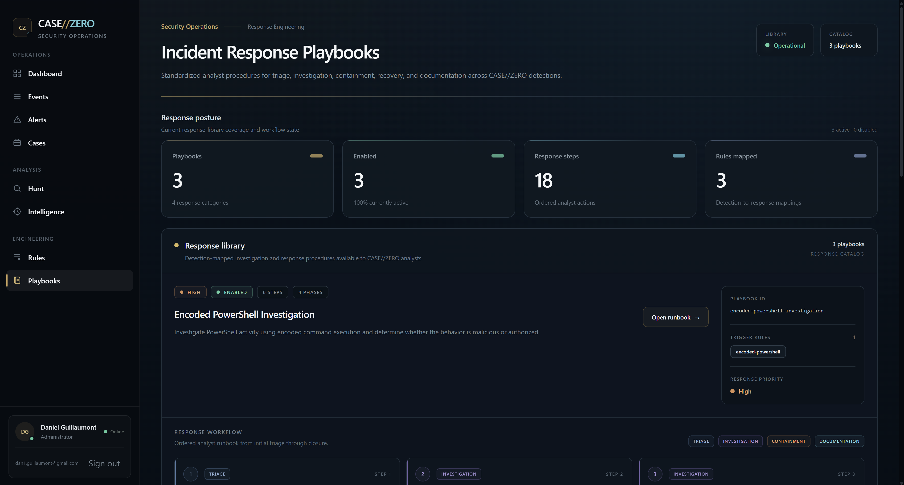

The current response library includes multiple active playbooks and maps response procedures directly to detection logic.

For the encoded PowerShell rule, the mapped procedure is:

```text
Encoded PowerShell Investigation
```

This creates a direct relationship:

```text
Detection Rule
      ↕
Response Playbook
```

Analysts can move from the rule into its response procedure, and from the response procedure back into the detection context.

---

## **12. Follow the Investigation Runbook**

The **Encoded PowerShell Investigation** runbook provides an ordered six-step workflow.

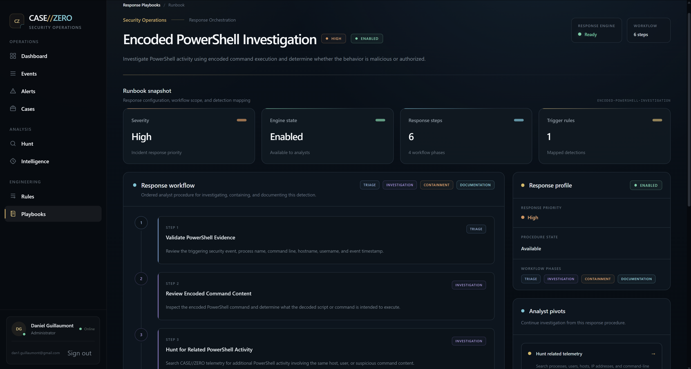

The procedure is organized into operational phases:

```text
TRIAGE
   ↓
INVESTIGATION
   ↓
CONTAINMENT
   ↓
DOCUMENTATION
```

Example analyst actions include:

1. Validate the triggering PowerShell evidence
2. Review the encoded command content
3. Hunt for related PowerShell activity
4. Continue investigation across associated telemetry
5. Perform response or containment actions
6. Document investigation findings

The result is a closed operational loop:

```text
Telemetry
   ↓
Detection
   ↓
Alert
   ↓
Investigation
   ↓
Hunt
   ↓
Evidence
   ↓
Response
   ↓
Documentation
```

---

# **Why CASE//ZERO Is More Than a Dashboard**

The project is intentionally relationship-driven.

A security event can produce an alert.

An alert knows which event and detection rule produced it.

A detection rule knows which response playbook is mapped to it.

An alert can become an investigation case.

A case maintains linked alerts, notes, activity, analyst ownership, and state.

A threat hunt can find related telemetry and provide new investigation pivots.

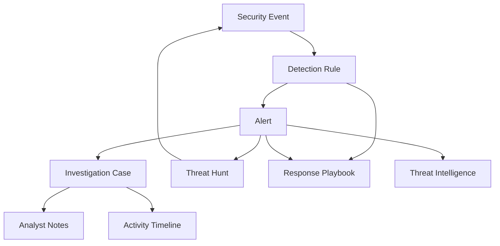
```mermaid
flowchart TD
    EVENT["Security Event"]
    RULE["Detection Rule"]
    ALERT["Alert"]
    CASE["Investigation Case"]
    HUNT["Threat Hunt"]
    PLAYBOOK["Response Playbook"]
    NOTE["Analyst Notes"]
    TIMELINE["Activity Timeline"]
    INTEL["Threat Intelligence"]

    EVENT --> RULE
    RULE --> ALERT
    ALERT --> CASE
    ALERT --> HUNT
    HUNT --> EVENT
    ALERT --> INTEL
    RULE --> PLAYBOOK
    ALERT --> PLAYBOOK
    CASE --> NOTE
    CASE --> TIMELINE
```

The goal is to model an analyst workflow, not simply display security-themed data.

---

# **Core Capabilities**

## **Detection & Telemetry**

- Normalized security-event ingestion
- Process telemetry
- Authentication telemetry
- Single-event detection rules
- Multi-event correlation
- Automatic alert generation
- Detection-to-event linkage
- Detection-to-alert linkage
- MITRE ATT&CK mappings

Current detections include:

- Encoded PowerShell
- PowerShell Download Cradle
- Authentication Brute Force

---

## **Alert Investigation**

- Prioritized alert queue
- Search and filtering
- Severity tracking
- Alert lifecycle management
- Analyst assignment
- Source-event evidence
- Detection-rule context
- MITRE ATT&CK context
- Investigation-case creation
- Existing-case linkage
- Recommended response playbooks

---

## **Case Management**

- Investigation case creation
- Case ownership
- Priority tracking
- Investigation lifecycle
- Linked alerts
- Analyst notes
- Case activity timeline
- Investigation metadata
- Related event visibility

---

## **Threat Hunting**

- Free-text telemetry search
- Structured filters
- Host searches
- Username searches
- IP searches
- Process searches
- Telemetry-source filtering
- Event-type filtering
- Time windows
- Direct event pivots

---

## **Threat Intelligence**

- Persistent IOC registry
- IP indicators
- Domain indicators
- URL indicators
- Hash indicators
- Reputation values
- Confidence scoring
- IOC tags
- Search and filtering
- IOC-to-event correlation
- Alert-to-IOC matching

---

## **Detection Engineering**

- Detection-rule catalog
- Detection logic visibility
- Rule state
- Severity classification
- Event coverage
- Single-event evaluation
- Multi-event correlation
- MITRE ATT&CK mappings
- Rule-to-response mappings

---

## **Incident Response**

- Response playbook catalog
- Detection-mapped procedures
- Ordered response steps
- Response phases
- Triage workflows
- Investigation workflows
- Containment guidance
- Documentation steps
- Rule ↔ Playbook navigation
- Analyst investigation pivots

---

# **Authentication & Access Control**

CASE//ZERO includes end-to-end authentication and role-based access control.

### **Authentication**

- PostgreSQL-backed user accounts
- Argon2 password hashing
- JWT access tokens
- HttpOnly session cookies
- Login workflow
- Logout workflow
- Current-user validation
- Protected frontend routes
- Administrator provisioning utility

### **Roles**

| Role | Access |
|---|---|
| **Administrator** | Full platform access |
| **Analyst** | Security operations, hunting, investigations, ingestion, and updates |
| **Viewer** | Read-only SOC visibility |

Unauthenticated users cannot access protected SOC data.

### **Login Abuse Protection**

Authentication hardening includes:

- Generic authentication failure messages
- Timing-resistant unknown-user password verification
- Persistent login-attempt tracking
- Temporary authentication cooldowns
- HTTP `429 Too Many Requests`
- `Retry-After` enforcement

```text
Email + Password
       ↓
Login Abuse Protection
       ↓
Argon2 Verification
       ↓
JWT Access Token
       ↓
HttpOnly Session
       ↓
Authenticated User
       ↓
Role Authorization
```

---

# **Security Hardening**

Production-readiness work includes:

- Environment-based configuration
- Environment-based frontend API routing
- Production configuration validation
- Trusted Host enforcement
- Production-aware Swagger / OpenAPI exposure
- Minimal public liveness endpoint
- Authenticated platform-status endpoint
- HttpOnly session cookies
- Production `Secure` / `__Host-` cookie strategy
- Server-only authentication utilities
- JWT expiration validation
- JWT integrity validation
- Persistent PostgreSQL-backed login throttling
- Generic authentication failures
- Temporary authentication lockout
- Database credentials outside source control
- Environment-specific deployment configuration
- CI validation before production changes

Public health endpoint:

```http
GET /api/health
```

Example:

```json
{
  "status": "online"
}
```

Detailed platform status requires authentication.

---

# **Production Architecture**

CASE//ZERO runs as a multi-service cloud application.

```text
                    ┌─────────────────────────┐
                    │          User           │
                    └────────────┬────────────┘
                                 │
                                 ▼
                    ┌─────────────────────────┐
                    │         Vercel          │
                    │    Next.js Frontend     │
                    │      TypeScript         │
                    └────────────┬────────────┘
                                 │
                                 │ HTTPS / API
                                 ▼
                    ┌─────────────────────────┐
                    │         Render          │
                    │      FastAPI API        │
                    │        Python           │
                    └────────────┬────────────┘
                                 │
                                 │ PostgreSQL
                                 ▼
                    ┌─────────────────────────┐
                    │          Neon           │
                    │      PostgreSQL 18      │
                    └─────────────────────────┘
```

## **Production Services**

| Layer | Platform | Purpose |
|---|---|---|
| Frontend | **Vercel** | Next.js production hosting |
| Backend | **Render** | FastAPI application hosting |
| Database | **Neon** | PostgreSQL 18 |
| CI | **GitHub Actions** | Backend tests and frontend production builds |
| Source Control | **GitHub** | Repository and deployment source |
| Local Database | **Docker** | PostgreSQL development environment |

The production frontend communicates with the Render-hosted FastAPI API, which persists data in Neon PostgreSQL.

Database migrations are managed through Alembic during backend deployment.

---

# **Application Architecture**

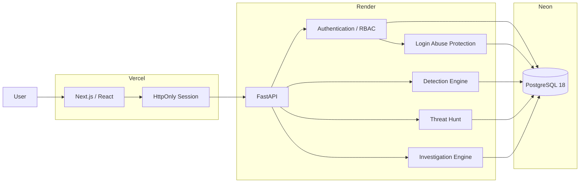
```mermaid
flowchart LR
    USER["User"]

    subgraph FRONTEND["Vercel"]
        NEXT["Next.js / React"]
        SESSION["HttpOnly Session"]
    end

    subgraph BACKEND["Render"]
        API["FastAPI"]
        AUTH["Authentication / RBAC"]
        THROTTLE["Login Abuse Protection"]
        DET["Detection Engine"]
        HUNT["Threat Hunt"]
        CASES["Investigation Engine"]
    end

    subgraph DATA["Neon"]
        DB[("PostgreSQL 18")]
    end

    USER --> NEXT
    NEXT --> SESSION
    SESSION --> API

    API --> AUTH
    AUTH --> THROTTLE
    API --> DET
    API --> HUNT
    API --> CASES

    AUTH --> DB
    THROTTLE --> DB
    DET --> DB
    HUNT --> DB
    CASES --> DB
```

---

# **Core APIs**

```text
/api/auth
/api/health
/api/status
/api/events
/api/alerts
/api/cases
/api/hunt
/api/rules
/api/playbooks
/api/intelligence
```

Examples of platform operations include:

```text
GET    /api/events
GET    /api/alerts
PATCH  /api/alerts/{id}
POST   /api/alerts/{id}/case

GET    /api/cases
GET    /api/cases/{id}
PATCH  /api/cases/{id}
POST   /api/cases/{id}/notes

GET    /api/rules
GET    /api/playbooks
GET    /api/intelligence
```

---

# **Technology Stack**

| Area | Technology |
|---|---|
| Frontend | Next.js, React, TypeScript |
| Styling | Tailwind CSS |
| Backend | FastAPI, Python |
| Validation | Pydantic |
| ORM | SQLAlchemy |
| Database | PostgreSQL 18 |
| Production Database | Neon |
| Database Migrations | Alembic |
| Authentication | JWT, OAuth2 |
| Password Security | Argon2, pwdlib |
| Authorization | RBAC |
| Testing | Pytest, FastAPI TestClient |
| CI/CD | GitHub Actions |
| Frontend Hosting | Vercel |
| Backend Hosting | Render |
| Local Infrastructure | Docker Compose |
| API Documentation | Swagger / OpenAPI |

---

# **Database Architecture**

CASE//ZERO uses PostgreSQL in both local development and production.

## **Local Development**

```text
FastAPI
   ↓
Docker Compose
   ↓
PostgreSQL 18
```

## **Production**

```text
FastAPI on Render
       ↓
Neon
       ↓
PostgreSQL 18
```

Production data was migrated from the original Render PostgreSQL deployment to Neon using PostgreSQL-native backup and restore tooling.

The migration preserved:

- Application schema
- Alembic migration state
- Users
- Authentication data
- Security events
- Alerts
- Cases
- Case notes
- Case activities
- Audit events
- Threat indicators
- Login throttle state
- Indexes
- Constraints
- Foreign keys

---

# **Testing & CI**

CASE//ZERO includes **86 passing backend tests** covering the platform's major security and application workflows.

Test coverage includes:

- Detection-engine logic
- Multi-event correlation
- Authentication
- Password security
- JWT creation
- JWT validation
- Login throttling
- Generic authentication failures
- Role-based access control
- API authorization
- Application security controls
- Trusted Host validation
- Public health endpoint
- Authenticated platform status
- Event ingestion
- Event-to-alert pipelines
- Alert workflows
- Case workflows
- Case notes
- Case activity history
- Threat hunting
- Threat intelligence
- Viewer permissions
- Analyst permissions
- Administrator permissions

Example tested detection pipeline:

```text
Security Event
      ↓
PostgreSQL
      ↓
Detection Engine
      ↓
Persisted Alert
      ↓
Authenticated API Retrieval
```

Authentication abuse protection is also integration tested:

```text
Failed Login
     ↓
Persistent Throttle State
     ↓
Failure Threshold
     ↓
Temporary Cooldown
     ↓
429 + Retry-After
```

---

## **GitHub Actions**

CI runs on pushes and pull requests to `main`.

```text
Backend
├── PostgreSQL 18 service
├── Alembic migrations
└── Pytest

Frontend
├── npm ci
└── Next.js production build
```

The frontend CI environment is configured with the API endpoint required for Next.js production builds.

---

# **Local Development**

## **Requirements**

- Python 3.12+
- Node.js 22+
- Docker Desktop
- Git

---

## **1. Clone the Repository**

```powershell
git clone https://github.com/danielguillaumont/case-zero.git
cd case-zero
```

---

## **2. Configure the Environment**

Create the local environment file:

```powershell
Copy-Item .env.example .env
```

Configure the PostgreSQL and JWT values inside `.env`.

Do not commit production credentials to source control.

---

## **3. Start PostgreSQL**

```powershell
docker compose up -d
```

Verify the container:

```powershell
docker compose ps
```

---

## **4. Start the Backend**

```powershell
cd backend

python -m venv .venv

Set-ExecutionPolicy -Scope Process -ExecutionPolicy RemoteSigned

.\.venv\Scripts\Activate.ps1

pip install -r requirements.txt

alembic upgrade head

python -m uvicorn app.main:app --reload
```

Backend API:

```text
http://127.0.0.1:8000
```

Health endpoint:

```text
http://127.0.0.1:8000/api/health
```

Swagger / OpenAPI in local development:

```text
http://127.0.0.1:8000/docs
```

API documentation can be disabled through environment configuration in production.

---

## **5. Create the First Administrator**

```powershell
python -m scripts.create_admin
```

---

## **6. Start the Frontend**

Open another terminal:

```powershell
cd frontend

npm install

npm run dev
```

Frontend:

```text
http://localhost:3000
```

---

## **Local Production Build**

```powershell
$env:CASE_ZERO_API_URL = "http://127.0.0.1:8000"

npm run build
```

---

# **Production Deployment**

## **Frontend — Vercel**

The Next.js application is deployed on Vercel:

```text
https://case-zero-nine.vercel.app
```

Vercel receives:

```text
CASE_ZERO_API_URL
```

which points server-side frontend requests to the production FastAPI API.

---

## **Backend — Render**

The FastAPI backend is deployed on Render.

Production startup:

```text
alembic upgrade head &&
uvicorn app.main:app --host 0.0.0.0 --port $PORT
```

This ensures pending database migrations are applied before the API begins serving traffic.

---

## **Database — Neon**

Production PostgreSQL is hosted on Neon using PostgreSQL 18.

Database credentials are supplied to Render using environment variables rather than being stored in the repository.

---

# **Security Workspaces**

CASE//ZERO currently contains eight primary operational workspaces:

```text
Dashboard
   │
   ├── Events
   │
   ├── Alerts
   │
   ├── Cases
   │
   ├── Threat Hunt
   │
   ├── Threat Intelligence
   │
   ├── Detection Rules
   │
   └── Response Playbooks
```

They share the same underlying security data and investigation relationships.

The intention is for analysts to **pivot between contexts** rather than repeatedly starting from scratch.

---

# **Detection-to-Response Relationships**

A central design goal of CASE//ZERO is preserving relationships between the objects used during an investigation.

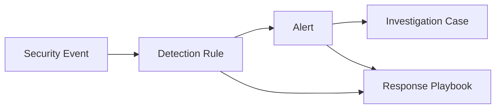
```mermaid
flowchart LR
    E["Security Event"]
    R["Detection Rule"]
    A["Alert"]
    C["Investigation Case"]
    P["Response Playbook"]

    E --> R
    R --> A
    A --> C
    R --> P
    A --> P
```

For the PowerShell example shown above:

```text
powershell.exe telemetry
        ↓
Encoded PowerShell Rule
        ↓
Encoded PowerShell Alert
        ↓
Investigation Case
        ↓
Encoded PowerShell Response Playbook
```

That relationship is visible throughout the UI.

---

# **Release History**

## **v2.0.1 — CASE//ZERO UI V2 Production Patch**

A maintenance release following the UI V2 launch, focused on restoring and validating production analyst workflows.

### **Fixes**

- Corrected production API routing for Next.js server actions
- Replaced production loopback API calls with environment-based `CASE_ZERO_API_URL` routing
- Restored alert assignment workflows in production
- Restored alert lifecycle transitions
- Restored investigation case creation and alert-to-case linking
- Restored case status updates
- Restored analyst note creation
- Validated alert, case, event, detection-rule, and response-playbook pivots in production

### **Documentation**

- Added 12 production UI screenshots
- Added an end-to-end Encoded PowerShell investigation walkthrough
- Expanded product, architecture, security, testing, and deployment documentation
- Documented the production Vercel → Render → Neon architecture

The production issue was traced to server actions that still referenced the local FastAPI development endpoint instead of the environment-configured production API.

This release represents the production-validated UI V2 portfolio checkpoint.

---

## **v2.0.0 — CASE//ZERO UI V2**

UI V2 replaced the original interface with a unified security-operations design system.

Major improvements included:

- Redesigned analyst authentication experience
- Redesigned application shell and navigation
- New operational dashboard
- New Security Event Explorer
- Redesigned event investigation workspace
- Redesigned alert-management workflow
- Redesigned alert investigation workspace
- Redesigned case-management workflow
- Redesigned investigation workspace
- New threat-hunting experience
- Redesigned threat-intelligence registry
- Redesigned detection-engineering views
- Redesigned response-playbook library
- Redesigned runbook experience
- Unified status indicators
- Unified metric cards
- Unified tables
- Unified typography
- Unified workflow states

The redesign preserved the existing FastAPI, PostgreSQL, authentication, detection-engine, and investigation architecture while substantially upgrading the analyst experience.

---

# **Stable Checkpoints**

Three Git tags preserve important milestones in the project.

### **Pre-UI V2**

```text
pre-ui-v2
```

Represents the stable production architecture before the major interface redesign.

### **UI V2**

```text
v2.0.0
```

Represents the initial completed CASE//ZERO UI V2 milestone.

### **UI V2 Production Patch**

```text
v2.0.1
```

Represents the production-validated UI V2 state with corrected server-action API routing, restored analyst workflows, and the completed portfolio documentation.

---

# **Current Project State**

CASE//ZERO is currently in a **production-stable portfolio state**.

### **Completed**

- [x] Full-stack SOC application
- [x] PostgreSQL + Alembic
- [x] Security-event ingestion
- [x] Detection engine
- [x] Single-event detection
- [x] Multi-event correlation
- [x] Automated alert generation
- [x] Alert investigation
- [x] Analyst assignment
- [x] Alert lifecycle management
- [x] Case creation
- [x] Case management
- [x] Analyst notes
- [x] Investigation activity timelines
- [x] Threat hunting
- [x] MITRE ATT&CK mappings
- [x] Detection-rule catalog
- [x] Incident-response playbooks
- [x] Threat-intelligence registry
- [x] IOC correlation
- [x] JWT authentication
- [x] HttpOnly frontend sessions
- [x] Login and logout workflow
- [x] Argon2 password hashing
- [x] Administrator / Analyst / Viewer roles
- [x] Route-level RBAC
- [x] Protected frontend routes
- [x] Trusted Host enforcement
- [x] Production API documentation controls
- [x] Public / authenticated health separation
- [x] Persistent login abuse protection
- [x] Generic authentication failure handling
- [x] Database-backed integration tests
- [x] GitHub Actions CI
- [x] Vercel frontend deployment
- [x] Render backend deployment
- [x] Neon PostgreSQL production database
- [x] Render PostgreSQL → Neon migration
- [x] Production environment validation
- [x] UI V2 redesign
- [x] Production workflow validation
- [x] Portfolio documentation and screenshots
- [x] Public production application

---

# **Future Engineering Ideas**

CASE//ZERO can be extended further without changing the core investigation model.

Potential future work includes:

- Case-centric SOAR workflows
- Evidence and investigation graphs
- Detection-as-Code
- Security-tool connectors
- Expanded threat-intelligence workflows
- Additional detection rules
- Investigation intelligence
- AI-assisted security analysis
- Human approval gates for response actions
- Automated containment workflows
- Detection feedback and outcome learning
- Expanded security audit visibility
- Additional application security hardening
- Content Security Policy
- Additional responsive UI work

---

# **Engineering Goals Demonstrated**

CASE//ZERO is intended to demonstrate practical engineering experience across both cybersecurity and software development.

### **Cybersecurity**

- Detection Engineering
- Security Operations
- Alert Triage
- Incident Investigation
- Incident Response
- Threat Hunting
- Threat Intelligence
- MITRE ATT&CK
- Authentication Security
- Application Security
- Role-Based Access Control

### **Backend Engineering**

- Python
- FastAPI
- REST APIs
- SQLAlchemy
- Pydantic
- PostgreSQL
- Alembic
- Authentication
- Authorization
- Database migrations
- Automated testing

### **Frontend Engineering**

- Next.js
- React
- TypeScript
- Tailwind CSS
- Server Components
- Server Actions
- Protected application routes
- Data-driven UI
- Security workflow design

### **Infrastructure & Delivery**

- Docker
- Git
- GitHub
- GitHub Actions
- Vercel
- Render
- Neon
- Environment management
- CI/CD
- Multi-service cloud deployment

---

# **Project Goal**

CASE//ZERO started as an experiment in building a security analyst platform.

It evolved into a full-stack application that connects:

**Detection Engineering · Security Operations · Incident Response · Threat Hunting · Threat Intelligence · MITRE ATT&CK · Authentication · Application Security · RBAC · API Development · Database Engineering · Full-Stack Development · Automated Testing · CI/CD · Docker · PostgreSQL · Cloud Deployment**

The most important part of the project is not any individual dashboard.

It is the workflow between them.

```text
Observe
   ↓
Detect
   ↓
Investigate
   ↓
Correlate
   ↓
Hunt
   ↓
Respond
   ↓
Document
```

**CASE//ZERO — Investigate. Correlate. Respond.**